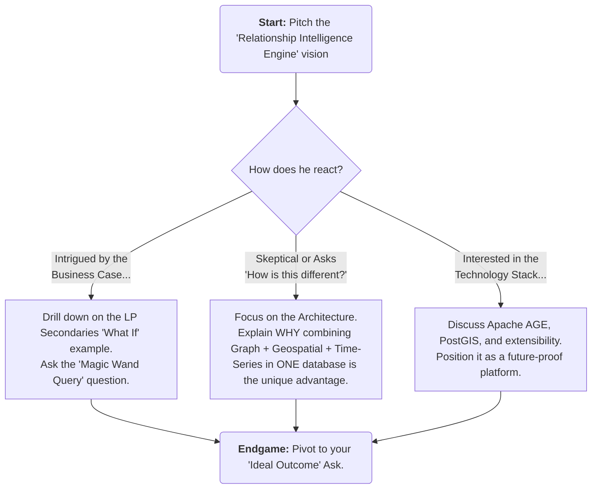

```mermaid
graph TD
    A("<b>Start:</b> Pitch the 'Relationship Intelligence Engine' vision") --> B{How does he react?};
    B -- "Intrigued by the<br/>Business Case..." --> C["Drill down on the LP Secondaries 'What If' example.<br/>Ask the 'Magic Wand Query' question."];
    B -- "Skeptical or Asks<br/>'How is this different?'" --> D["Focus on the Architecture.<br/>Explain WHY combining Graph + Geospatial + Time-Series in ONE database is the unique advantage."];
    B -- "Interested in the<br/>Technology Stack..." --> E["Discuss Apache AGE, PostGIS, and extensibility.<br/>Position it as a future-proof platform."];
    C & D & E --> F("<b>Endgame:</b> Pivot to your 'Ideal Outcome' Ask.");
```
