--- START OF FILE orchestration_architecture.md ---

# 🏛️ Orchestration Architecture: From Local Dev to CI/CD

This document is the SSOT for understanding how the project's configuration, environment, and automation files work together. It explains the two parallel "universes" where your code runs: your **Local Dev Environment** and the **Remote CI/CD Environment**.

## The Master Diagram

```mermaid
%%{init: {'theme': 'dark'}}%%
graph TD
    subgraph " "
        Dev["👨‍💻<br/><b>Developer</b>"]
    end

    subgraph "Local Environment (Your Machine)"
        direction LR
        A["VS Code"] --> B[".devcontainer/devcontainer.json<br/><i>The User Manual</i>"]
        B --> C["docker-compose.yml<br/><i>The Orchestrator</i>"]
        C --> D["Dockerfile<br/><i>The Blueprint</i>"]
        M["Makefile<br/><i>The Shortcuts</i>"]
        P[".pre-commit-config.yaml<br/><i>The Quality Gate</i>"]
        Dev -- "make start" --> M
        Dev -- "Open Folder" --> A
        Dev -- "git commit" --> P
    end

    subgraph "Shared Configuration (The SSOT)"
        direction TB
        C
        D
        E[".env<br/><i>The Secrets</i>"]
    end

    subgraph "Remote Environment (GitHub)"
        direction LR
        F["GitHub<br/>(git push)"] --> G[".github/workflows/ci.yml<br/><i>The CI/CD Plan</i>"]
        G --> C
        C --> D
    end

    style A fill:#2b2b2b,stroke:#a9a9a9,color:#fff
    style G fill:#2b2b2b,stroke:#a9a9a9,color:#fff
```

## The Natural Language Explanation

Think of your DevOps setup as a recipe for building two identical kitchens: one in your house (local) and one in a professional test kitchen (CI/CD). Both kitchens must be identical to ensure the food tastes the same.

### The Files and Their Roles

*   **`Makefile` (The Shortcuts):**
    *   **Purpose:** Provides simple, memorable commands (`make start`, `make test`) for you, the developer.
    *   **How it Works:** This is a local convenience. It translates your simple command into a more complex `docker compose` command. It is **never** used by the CI/CD pipeline.

*   **`.devcontainer/devcontainer.json` (The User Manual):**
    *   **Purpose:** This is the instruction manual for **VS Code**. It says, "To work on this project, you need to be inside a container. The instructions for building and running that container are in `docker-compose.yml`."
    *   **How it Works:** It also tells VS Code which extensions to install (`Atlassian`, `Python`, etc.) and what settings to use, fully automating your editor setup. This file is **only** used locally by you.

*   **`Dockerfile` (The Blueprint):**
    *   **Purpose:** This is the master blueprint for your main `app` container. It lists all the ingredients (the base OS), the system packages (`apt-get install ...`), and the core setup instructions.
    *   **How it Works:** It is used by **both** your local Docker and the remote GitHub Actions runner to build an identical application environment.

*   **`docker-compose.yml` (The Orchestrator):**
    *   **Purpose:** This is the master plan that defines all the services in your application (`app`, `timescaledb`) and how they connect to each other (the network).
    *   **How it Works:** It reads the blueprints (`Dockerfile`, `Dockerfile.postgres`) and tells Docker how to assemble the final, running application. This file is the **core of your environment** and is used by **both** local and remote setups.

*   **`.env` (The Secrets):**
    *   **Purpose:** This file holds all your secret keys and environment-specific settings. It is **never** committed to Git.
    *   **How it Works:** `docker-compose.yml` reads this file to inject the secrets into the running containers. In the CI pipeline, this file is created dynamically from GitHub's encrypted secrets.

*   **`.pre-commit-config.yaml` (The Local Quality Gate):**
    *   **Purpose:** To prevent mistakes before they happen.
    *   **How it Works:** Every time you run `git commit`, this file tells the `pre-commit` tool to run a series of checks (like `check-json` and `check-added-large-files`). If any check fails, the commit is aborted. This is your **personal, local safety net**.

*   **`.github/workflows/ci.yml` (The CI/CD Plan):**
    *   **Purpose:** This is the instruction manual for the **GitHub Actions** runner.
    *   **How it Works:** When you `git push`, GitHub reads this file and follows its instructions. You'll notice the steps are very similar to your local setup: it checks out the code, starts the containers using `docker-compose.yml`, and runs the tests. This is your **automated, remote quality gate**.

### The Grand Unified Flow

1.  **Locally,** you use `make start` or let VS Code handle it via `devcontainer.json`. Docker Compose reads `docker-compose.yml` and `.env`, uses `Dockerfile` to build the `app` container, and you start working.
2.  When you're ready, you `git commit`. Your `.pre-commit-config.yaml` runs and ensures your code is clean before it's even saved in Git.
3.  You then `git push`. This triggers the workflow in `ci.yml`.
4.  **Remotely,** a fresh virtual machine spins up. It uses the exact same `docker-compose.yml` and `Dockerfile` to build the exact same environment, proving that your work is reproducible. It runs the tests.
5.  If all tests pass, you get a green checkmark, and you are confident that your changes are safe to merge.

**The Key Takeaway:** The entire system is designed around one core principle: **Consistency.** By using the same core files (`Dockerfile`, `docker-compose.yml`) in both your local and remote environments, you eliminate surprises and ensure that code that "works on my machine" will also work in production.

---
--- END OF FILE ---
