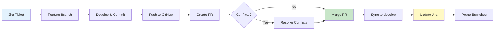

# 🔀 Git Workflow Guide: From Feature to Production

**Version:** 1.0  
**Status:** ✅ Active  
**Audience:** All Project Chronos contributors

This guide documents our complete Git workflow, from creating a feature branch to resolving conflicts and integrating with Jira.

---

## 🎯 **Overview: The Complete Flow**



---

## 📋 **Phase 1: Start from Jira**

### **Step 1.1: Create Jira Ticket**

**In Jira:**

1. Click **"Create"**
2. Fill in details:
   - **Summary**: `feat(component): Description`
   - **Type**: Story/Bug/Spike
   - **Labels**: 2-4 relevant labels
   - **Sprint**: Current sprint or Backlog
3. Click **"Create"**
4. **Copy the ticket number** (e.g., `CHRONOS-87`)

### **Step 1.2: Move to "In Progress"**

- Drag ticket to **"In Progress"** column
- This signals you're working on it

---

## 🌿 **Phase 2: Create Feature Branch**

### **Step 2.1: Ensure develop is up-to-date**

```bash
# Always start from clean develop
git checkout develop
git pull origin develop

# Verify you're current
git log --oneline -3
```

### **Step 2.2: Create feature branch**

**Naming Convention:**

```
<type>/<ticket>-<brief-description>
```

**Examples:**

- `feat/CHRONOS-87-alembic-setup`
- `fix/CHRONOS-94-precommit-hooks`
- `docs/CHRONOS-97-git-workflow`

**Command:**

```bash
# Create and switch to feature branch
git checkout -b feat/CHRONOS-87-alembic-setup

# Verify
git branch
# Should show: * feat/CHRONOS-87-alembic-setup
```

---

## 💻 **Phase 3: Develop & Commit**

### **Step 3.1: Make your changes**

Work normally in your IDE (VS Code).

### **Step 3.2: Stage changes**

```bash
# See what changed
git status

# Stage specific files
git add file1.py file2.md

# Or stage everything (be careful!)
git add -A

# Review staged changes
git status
```

### **Step 3.3: Commit with Conventional Commits**

**Format:**

```
<type>(<scope>): <subject>

<body>

<footer>
```

**Types:**

- `feat`: New feature
- `fix`: Bug fix
- `refactor`: Code restructuring
- `docs`: Documentation
- `test`: Tests
- `chore`: Maintenance

**Example:**

```bash
git commit -m "feat(db): Initialize Alembic migration framework

- Install Alembic package
- Configure config/alembic.ini with database URL
- Create baseline migration
- Stamp database with current version

JIRA: Closes CHRONOS-87
Related to CHRONOS-88"
```

**If pre-commit fails:**

```bash
# Bypass hooks temporarily (use sparingly!)
git commit --no-verify -m "your message"

# Create tech debt ticket to fix hooks later
```

---

## 🚀 **Phase 4: Push to GitHub**

### **Step 4.1: Push feature branch**

```bash
# First time pushing this branch
git push -u origin feat/CHRONOS-87-alembic-setup

# Subsequent pushes
git push origin feat/CHRONOS-87-alembic-setup
```

**Output will show:**

```
Create a pull request for 'feat/CHRONOS-87-alembic-setup' on GitHub by visiting:
https://github.com/USERNAME/project-chronos/pull/new/feat/CHRONOS-87-alembic-setup
```

---

## 🔀 **Phase 5: Create Pull Request**

### **Step 5.1: Open PR on GitHub**

**Option A: Web Interface**

1. Go to the URL from git push output
2. Or click banner on GitHub: "Compare & pull request"

**Option B: GitHub CLI** (future)

```bash
gh pr create --title "feat(db): Initialize Alembic" \
  --body "Closes CHRONOS-87"
```

### **Step 5.2: Fill in PR details**

**Title Format:**

```
<type>(<scope>): Brief description
```

**Description Template:**

```markdown
## 🎯 Goal

Brief explanation of what this PR accomplishes.

## ✅ Completed Tickets

- CHRONOS-87: Initialize Alembic

## 🔧 Changes

- Bullet list of changes
- Be specific and concise

## 🧪 Testing

- [ ] Manual testing completed
- [ ] Unit tests pass
- [ ] Integration tests pass

## 📝 Documentation

- [ ] README updated
- [ ] Inline comments added
- [ ] Guide created

## 🔗 Related Issues

Closes #87
Related to #88, #89

## 📸 Evidence (optional)

Screenshots or terminal output showing it works.
```

### **Step 5.3: Assign reviewers**

For solo projects: Assign yourself

### **Step 5.4: Add labels**

Match your Jira labels:

- `database`
- `migration`
- `sprint-5`

---

## ⚠️ **Phase 6: Resolve Conflicts (If Any)**

### **Scenario A: No Conflicts**

✅ Skip to Phase 7 (Merge PR)

### **Scenario B: Conflicts Detected**

#### **Method 1: GitHub Web Editor** (Easiest for small conflicts)

1. Click **"Resolve conflicts"** button
2. GitHub shows conflict markers:
   ```
   <<<<<<< feat/CHRONOS-87-alembic-setup
   Your changes
   =======
   develop's changes
   >>>>>>> develop
   ```
3. Edit file to keep the correct version
4. Remove conflict markers
5. Click **"Mark as resolved"**
6. Click **"Commit merge"**

#### **Method 2: Command Line** (Better for complex conflicts)

```bash
# Fetch latest develop
git fetch origin develop

# Merge develop into your feature branch
git merge origin/develop

# Git will tell you which files have conflicts
# Edit each file to resolve conflicts

# After resolving, stage files
git add <resolved-file>

# Complete the merge
git commit -m "chore(merge): Resolve conflicts with develop"

# Push
git push origin feat/CHRONOS-87-alembic-setup
```

#### **Method 3: Accept All Your Changes** (When your branch has ALL the work)

```bash
# Merge develop but keep your changes for conflicts
git merge origin/develop --strategy-option ours \
  -m "chore(merge): Merge develop, keep feature changes"

# Push
git push origin feat/CHRONOS-87-alembic-setup
```

#### **Method 4: Accept All Their Changes** (Rare)

```bash
# Merge develop and keep develop's changes for conflicts
git merge origin/develop --strategy-option theirs \
  -m "chore(merge): Merge develop, use develop changes"

# Push
git push origin feat/CHRONOS-87-alembic-setup
```

### **Conflict Prevention Best Practices**

1. **Pull develop before creating feature branch**
2. **Keep feature branches short-lived** (< 1 day)
3. **Sync with develop frequently** for long features
4. **Communicate** with team about what you're working on

---

## ✅ **Phase 7: Merge Pull Request**

### **Step 7.1: Verify checks pass**

Wait for:

- ✅ Test suite passes
- ✅ Linting passes
- ✅ No conflicts

### **Step 7.2: Choose merge strategy**

**Squash and Merge** (Recommended for solo projects)

- Combines all commits into one
- Keeps develop history clean
- Click **"Squash and merge"**

**Merge Commit** (For collaborative projects)

- Preserves all individual commits
- Shows exact work history

**Rebase and Merge** (For linear history)

- Rewrites feature commits on top of develop
- No merge commit

### **Step 7.3: Confirm merge**

1. Click **"Confirm squash and merge"**
2. Optionally edit commit message
3. GitHub will close the PR automatically

### **Step 7.4: Delete feature branch**

GitHub will prompt: **"Delete branch"**

- Click it to clean up remote branch

---

## 🔄 **Phase 8: Sync Local Repository**

### **Step 8.1: Switch to develop**

```bash
git checkout develop
```

### **Step 8.2: Pull merged changes**

```bash
git pull origin develop
```

### **Step 8.3: Verify merge**

```bash
# Check recent commits
git log --oneline -5

# Verify your files are there
ls -la scripts/your-new-script.sh
```

### **Step 8.4: Delete local feature branch**

```bash
# Delete local branch
git branch -d feat/CHRONOS-87-alembic-setup

# If Git complains, force delete
git branch -D feat/CHRONOS-87-alembic-setup
```

---

## 🧹 **Phase 9: Prune Remote References**

### **Step 9.1: Remove stale references**

```bash
# Preview what will be pruned
git remote prune origin --dry-run

# Actually prune
git remote prune origin

# Or use fetch --prune
git fetch --prune
```

### **Step 9.2: Verify clean state**

```bash
# List all branches (local + remote)
git branch -a

# Should NOT show deleted feature branches
```

---

## 🎯 **Phase 10: Update Jira**

### **Step 10.1: Move ticket to Done**

**In Jira:**

1. Find your ticket (CHRONOS-87)
2. Click **"Transition"** → **"Done"**
3. Or drag to **"Done"** column

### **Step 10.2: Add resolution comment**

Add a comment with:

- Link to merged PR
- Link to documentation (if applicable)
- Any follow-up tickets created

**Example:**

```
✅ Completed in PR #17
📚 Documentation: docs/4_guides/alembic_workflow.md
🔗 Related: CHRONOS-88 (next step: data ingestion)

Technical debt created:
- CHRONOS-94 (fix pre-commit hooks)
```

### **Step 10.3: Update Sprint board**

If ticket was in current sprint:

- Verify it's in **"Done"** column
- Sprint velocity will update automatically

---

## 🔗 **Jira ↔ GitHub Integration**

### **Automatic Linking**

GitHub automatically links to Jira when you:

1. **Reference ticket in commit:**

   ```
   feat(db): Add feature

   JIRA: Closes CHRONOS-87
   ```

2. **Reference ticket in PR description:**

   ```markdown
   Closes CHRONOS-87
   Related to CHRONOS-88
   ```

3. **Use smart commits:**
   ```
   git commit -m "CHRONOS-87 #comment This is working well"
   git commit -m "CHRONOS-87 #time 2h 30m Work completed"
   ```

### **Viewing in Jira**

In Jira ticket:

- **Development** section shows linked PRs
- **Commits** tab shows all commits
- Click to view in GitHub

---

## 🚨 **Troubleshooting**

### **Problem: "Updates were rejected"**

**Cause:** Remote has changes you don't have locally.

**Solution:**

```bash
git pull origin develop --rebase
git push origin your-branch
```

---

### **Problem: "fatal: refusing to merge unrelated histories"**

**Cause:** Branches have completely diverged.

**Solution:**

```bash
git merge origin/develop --allow-unrelated-histories
```

---

### **Problem: "Detached HEAD state"**

**Cause:** Checked out a commit instead of a branch.

**Solution:**

```bash
# Create branch from current position
git checkout -b recovery-branch

# Or go back to develop
git checkout develop
```

---

### **Problem: Accidentally committed to develop**

**Solution:**

```bash
# Create feature branch from current position
git checkout -b feat/CHRONOS-XX-fix

# Reset develop to remote
git checkout develop
git reset --hard origin/develop

# Switch back to feature branch
git checkout feat/CHRONOS-XX-fix
```

---

### **Problem: Need to undo last commit**

**Solution:**

```bash
# Undo commit, keep changes
git reset --soft HEAD~1

# Undo commit, discard changes (DANGEROUS!)
git reset --hard HEAD~1
```

---

## 📊 **Git Commands Quick Reference**

### **Branch Management**

```bash
# List branches
git branch                    # Local only
git branch -a                 # Local + remote

# Create branch
git checkout -b feat/new

# Switch branch
git checkout develop

# Delete branch
git branch -d feat/old        # Safe delete
git branch -D feat/old        # Force delete

# Rename branch
git branch -m old-name new-name
```

### **Sync Operations**

```bash
# Fetch
git fetch origin              # Get remote changes
git fetch --prune             # Remove stale refs

# Pull
git pull origin develop       # Fetch + merge
git pull --rebase             # Fetch + rebase

# Push
git push origin branch        # Push branch
git push -u origin branch     # Set upstream
git push --force              # Overwrite remote (DANGEROUS!)
```

### **Commit Operations**

```bash
# Stage
git add file.py               # Stage file
git add .                     # Stage all
git add -A                    # Stage all (including deletes)

# Commit
git commit -m "message"       # Commit
git commit --amend            # Modify last commit
git commit --no-verify        # Skip pre-commit hooks

# View
git status                    # See changes
git diff                      # See unstaged changes
git diff --staged             # See staged changes
git log --oneline -10         # Recent commits
```

---

## 🎓 **Best Practices**

### **✅ DO:**

- Pull develop before creating feature branch
- Use descriptive branch names
- Commit frequently with clear messages
- Reference Jira tickets in commits
- Keep PRs small and focused
- Review your own PR before submitting
- Delete branches after merge

### **❌ DON'T:**

- Commit directly to develop
- Use generic commit messages ("fix bug", "update")
- Create long-lived feature branches
- Force push to shared branches
- Commit large binary files
- Commit secrets or credentials

---

## 📚 **Further Reading**

- **Conventional Commits**: https://www.conventionalcommits.org/
- **Atlassian Git Tutorials**: https://www.atlassian.com/git/tutorials
- **Pro Git Book**: https://git-scm.com/book/en/v2
- **GitHub Flow**: https://docs.github.com/en/get-started/quickstart/github-flow
- **Jira Git Integration**: https://support.atlassian.com/jira-cloud-administration/docs/integrate-with-development-tools/

---

**Last Updated:** 2025-11-18  
**Next Review:** Sprint 6 Retrospective  
**Owner:** Geoff Bevans
