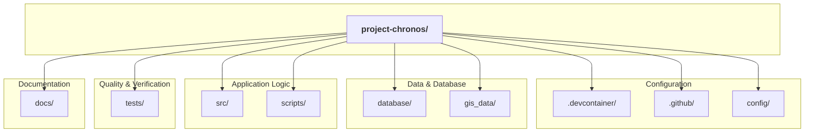

# 📂 Project Structure

**Version:** 2.0
**Status:** ✅ Live

This document is the Single Source of Truth for the structure of the Project Chronos repository, explaining the purpose of each key file and directory.

| Path | Purpose |
| :--- | :--- |
| **`.devcontainer/`** | 📦 Configuration for the VS Code Dev Container, ensuring a consistent, replicable development environment. |
| **`.github/`** | 🤖 Houses all GitHub Actions workflows for our automated CI/CD pipeline (linting, testing, etc.). |
| **`config/`** | ⚙️ Contains all project-wide configuration files (`pytest.ini`, `pre-commit-config.yaml`, etc.). |
| **`database/`** | 🐘 The heart of our data layer. Contains all SQL files for schema, views, and functions, as well as our metadata "seed" files. |
| `database/analysis/` | 🔬 Stores analytical artifacts and decision-making documents, like our RICE analysis CSV. |
| `database/seeds/` | 🌱 Contains the master CSV files that act as the SSOT for our metadata (`asset_catalog.csv`, `ontology_hub.csv`). |
| **`docs/`** | 📚 The project's central Knowledge Base. All narrative documentation, architectural diagrams, and design documents live here. |
| **`gis_data/`** | 🗺️ Storage for all raw geospatial data files (e.g., shapefiles), organized by country and layer. |
| **`scripts/`** | ⚡ Reusable automation and operational bash scripts for tasks like data ingestion and downloading. |
| **`src/chronos/`** | 🐍 The core Python application source code, including the ingestion engine and database connection logic. |
| **`tests/`** | 🧪 The Pytest suite, organized into `unit`, `integration`, and `e2e` tests to ensure code quality and prevent regressions. |

---
