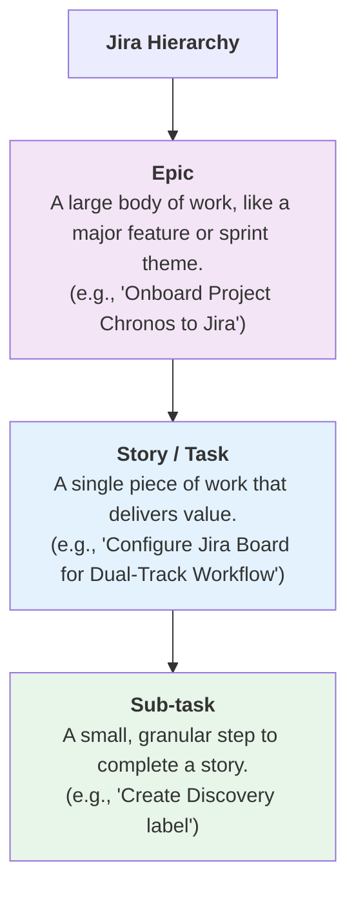

**Action:** Copy the entire content block below and save it to `docs/0_project_vision_and_strategy/2_the_phoenix_plan.md`.

---
--- START OF FILE 2_the_phoenix_plan.md ---

# 🔥 The Phoenix Plan: A 3-Sprint Roadmap to MVP

**Version:** 1.0
**Status:** ✍️ Proposed
**Purpose:** This document is the **Single Source of Truth (SSOT)** for the strategic roadmap of Project Chronos. It outlines a three-sprint plan to clear critical technical debt, harden the platform, and deliver a compelling, client-ready MVP. It also formalizes the "Dual-Track" workflow that will govern our process.

---

## (ALL ADDED LATER) On-Boarding to Jira:



## 🧭 1. The Dual-Track Workflow: Our New Operating Model

To ensure our development efforts are always aligned with a validated business need, we will adopt a formal "Dual-Track" Scrum workflow. This model separates the *problem-finding* process from the *solution-building* process, ensuring we build the right thing, and build it right.

```mermaid
graph TD
    subgraph "Sprint Cycle"
        direction LR
        A["<b>Discovery Track</b><br/>(You as Product Owner)"]
        B["<b>Delivery Track</b><br/>(You as Developer, Me as Scrum Master)"]
    end

    subgraph "Discovery Activities (Finding the 'Why')"
        C[🎯 Refine Investor Pitch] --> D[❓ Customer Dev Calls]
        D --> E[💡 Brainstorm & Prioritize Insights (RICE)]
    end
    
    subgraph "Delivery Activities (Building the 'What')"
        F[💻 Write Code] --> G[🧪 Write Tests]
        G --> H[🚀 Deploy/Demo]
    end

    E -- "Defines What to Build" --> F

    style A fill:#e3f2fd
    style B fill:#e8f0fe
```

## 🗺️ 2. The 3-Sprint Roadmap

This roadmap organizes our prioritized backlog into three distinct, focused sprints. Each sprint has a clear, measurable goal that builds upon the last, culminating in a successful MVP showcase.

### **🚀 Sprint 7: "The Foundation" (DevOps Hardening)**
**Goal:** Eliminate the biggest sources of technical debt and create a clean, stable, and automated foundation for all future development.

| PBI # | Epic | User Story | Acceptance Criteria |
| :---- | :--- | :--- | :--- |
| **PBI-1** | `refactor(ingestion)` | As a Developer, I want a single, data-driven ingestion script so that I can add new data series by only updating a CSV file, without changing any code. | <ul><li>A new `src/scripts/master_ingest.py` script exists.</li><li>Running it ingests all `Planned` series from `asset_catalog.csv`.</li><li>The old `bulk_ingest*` bash scripts are deprecated.</li></ul> |
| **PBI-2** | `refactor(db)` | As a Developer, I want a consolidated and ordered set of SQL files so that the database can be rebuilt from scratch reliably and predictably. | <ul><li>All `VIEW` definitions are moved into ordered SQL files.</li><li>`Dockerfile.timescaledb` only copies files from a single, unambiguous directory.</li></ul> |
| **PBI-3** | `refactor(db)` | As a Developer, I want to manage all future schema changes with a migration tool so that I can evolve the database schema safely and reversibly. | <ul><li>Alembic (or another tool) is initialized in the repository.</li><li>A "base" migration exists that represents the current schema.</li></ul> |
| **PBI-4** | `refactor(devops)` | As a Developer, I want all root-level config files moved into a `/config` directory so that the project root is clean and easy to navigate. | <ul><li>`Makefile`, `pyproject.toml`, etc. are moved.</li><li>All build/CI scripts are updated and all commands work flawlessly.</li></ul> |

### **🚂 Sprint 8: "The Engine" (Automation & Testing)**
**Goal:** Build on the stable foundation to automate test setup and dramatically increase test coverage, creating a fortress of reliability.

| PBI # | Epic | User Story | Acceptance Criteria |
| :---- | :--- | :--- | :--- |
| **PBI-5** | `feat(tests)` | As a Developer, I want automated data fixtures for Pytest so that my tests run against a clean, predictable, and isolated database every time. | <ul><li>`conftest.py` contains fixtures that seed a test database.</li><li>Integration tests no longer depend on a manually-seeded DB.</li></ul> |
| **PBI-6** | `test(coverage)` | As a Developer, I want to increase test coverage to over 80% so that I can refactor and add new features with high confidence that I won't break existing functionality. | <ul><li>`pytest --cov` reports >= 80% coverage.</li><li>The CI pipeline is updated to fail if coverage drops below this threshold.</li></ul> |

### **✨ Sprint 9: "The Showcase" (MVP & Outreach)**
**Goal:** With a hardened, automated, and tested platform, confidently build the client-facing MVP and prepare for the investor call.

| PBI # | Epic | User Story | Acceptance Criteria |
| :---- | :--- | :--- | :--- |
| **PBI-7** | `strategy(pitch)` | **(Discovery Track)** As the Founder, I need a clear, one-page pitch script so that I can confidently and effectively communicate the project's value to my investor. | <ul><li>We have answered the "tough questions."</li><li>A final script exists in `docs/0_project_vision_and_strategy/outreach/`.</li></ul> |
| **PBI-8** | `feat(mvp)` | **(Delivery Track)** As a Founder, I want an interactive dashboard comparing the Chicago and Toronto real estate markets to use as a powerful, concrete demo. | <ul><li>A new `analytics` view for Toronto exists.</li><li>A Metabase or Dash dashboard visualizes the key insights.</li></ul> |
| **PBI-9** | `feat(mvp)` | **(Delivery Track)** As a Founder, I want a polished PDF report summarizing the key insights so that I have a professional artifact to share after the call. | <ul><li>A new `docs/reports/real_estate_mvp_v1.md` exists.</li><li>It contains screenshots, analysis, and can be exported to a clean PDF.</li></ul> |

---

## 📋 3. Consolidated Backlog

This table represents the full, categorized backlog of all identified technical debt and feature ideas. The roadmap above pulls from this master list.

| Epic | Priority | PBI / Task Name | Status |
| :--- | :--- | :--- | :--- |
| **DevOps & Config** | High | `refactor(devops): Consolidate root config files into /config` | 🟡 To Do (Sprint 7) |
| | High | `refactor(db): Establish DB migration workflow (Alembic)` | 🟡 To Do (Sprint 7) |
| | Medium | `feat(devops): Establish Professional Issue Tracking (Jira)` | 🔵 Backlog |
| **Testing** | High | `feat(tests): Implement fixtures for test data setup` | 🟡 To Do (Sprint 8) |
| | High | `test(coverage): Increase test coverage to 80%` | 🟡 To Do (Sprint 8) |
| **Automation** | High | `feat(ingestion): Automate ingestion from asset_catalog.csv` | 🟡 To Do (Sprint 7) |
| **Database** | High | `refactor(db): Consolidate SQL Schema & Views` | 🟡 To Do (Sprint 7) |
| | Medium | `refactor(db): Standardize all table and column names` | 🔵 Backlog |
| | Low | `Review Ontology and standardize conventions` | 🔵 Backlog |
| **Tooling & DevEx** | Medium | `Poetry Workflow Integration` | 🔵 Backlog |
| | Low | `Mermaid to Excalidraw Workflow` | 🔵 Backlog |
| | Low | `Google Drive & Git via rclone` | 🔵 Backlog |
| | Low | `Install Data Wrangler` | 🔵 Backlog |
| | Low | `Install "evidence" for SQL/Markdown` | 🔵 Backlog |
| **MVP & Strategy** | Critical | `strategy(pitch): Refine Investor Pitch` | 🟠 To Do (Sprint 9) |
| | Critical | `feat(mvp): Build the MVP Dashboard` | 🟠 To Do (Sprint 9) |
| | Critical | `feat(mvp): Create the PDF Insight Report` | 🟠 To Do (Sprint 9) |
