# 🗺️ Design: Abstract Geospatial Views

**Version:** 1.0
**Status:** ✍️ In Design

This document outlines the design for abstract views that unify geospatial data from different countries into a common schema, enabling extensible cross-national queries.

## View 1: `analytics.v_admin_1_boundaries`

This view provides a unified table for all first-level administrative boundaries (e.g., US States, Canadian Provinces).

### **Architectural Goal**

The purpose of this view is to abstract away country-specific column names and provide a single, consistent interface for analysis. A query written against this view will work for any country whose data is included.

```mermaid
graph TD
    subgraph "Raw Boundary Tables"
        A["🇺🇸 boundaries.us_states <br/> (name, statefp, geom)"]
        B["🇨🇦 boundaries.ca_provinces_territories <br/> (prname, pruid, geom)"]
    end
    
    subgraph "Abstraction Layer"
        C[<b style='font-size:1.1em'>analytics.v_admin_1_boundaries</b>]
    end

    subgraph "Unified Schema"
        D["(country_code, admin_1_name, admin_1_code, geom)"]
    end

    subgraph "Analytical Queries"
        E[📈 All future geo-economic queries]
    end

    A -->|"UNION ALL"| C
    B -->|"UNION ALL"| C
    C --> D
    E -->|SELECT * FROM| C
```



### **Implementation Plan (SQL DDL)**

The view will be created using a `UNION ALL` to stack the data from the two source tables. We will use `AS` to rename the country-specific columns to our new, standardized names.

```sql
CREATE OR REPLACE VIEW analytics.v_admin_1_boundaries AS

-- Part 1: Select and standardize data from the US States table
SELECT
    'USA' AS country_code,
    name AS admin_1_name,
    statefp AS admin_1_code,
    geom
FROM
    boundaries.us_states

UNION ALL

-- Part 2: Select and standardize data from the Canadian Provinces table
SELECT
    'CAN' AS country_code,
    prname AS admin_1_name,
    pruid AS admin_1_code,
    geom
FROM
    boundaries.ca_provinces_territories;

-- Add a comment to the database to explain the view's purpose
COMMENT ON VIEW analytics.v_admin_1_boundaries IS 'A unified view of all first-level administrative boundaries (US States, Canadian Provinces, etc.), providing a common schema for cross-national analysis.';
```

### **Example Use Case (Throwaway Example)**

This demonstrates how a single query can now retrieve data for both countries seamlessly.

```sql
-- Get the name and area of the 5 largest admin_1 regions in North America
SELECT
    country_code,
    admin_1_name,
    (ST_Area(geom::geography) / 1000000) AS area_sq_km
FROM
    analytics.v_admin_1_boundaries
ORDER BY
    area_sq_km DESC
LIMIT 5;
```
