# 🚀 RICE Framework for Insight Verticals

This document outlines the tailored RICE (Relevance, Insight, Confidence, Ease) framework used in Project Chronos to prioritize the development of new analytical verticals.

## 🏛️ The "Insight Vertical Funnel" Workflow

Our process follows a three-stage funnel to ensure that our development efforts are always strategically aligned with creating maximum value.

```mermaid
graph TD
    A[<b>Stage 1:</b> Vertical Selection] --> B[<b>Stage 2:</b> Insight Brainstorming]
    B --> C[<b>Stage 3:</b> Data & View Design]

    subgraph A [ ]
        style A fill:#e3f2fd
        A1(💡 Brainstorm Verticals) --> A2(🔎 RICE Scoring)
        A2 --> A3(🎯 Select Highest-Scoring Vertical)
    end
    subgraph B [ ]
        style B fill:#e8f5e9
        B1(❓ Ask Key Questions within Vertical) --> B2(🔗 Identify Cross-Domain Correlations)
        B2 --> B3(📋 Prioritize Specific Insights)
    end
    subgraph C [ ]
        style C fill:#f3e5f5
        C1(📊 Identify Required Data Series) --> C2(✍️ Design Analytical Views)
    end
```

## 📊 RICE Scoring Methodology

Each potential vertical is scored on four factors, from 1 (Low) to 3 (High). The total score determines the priority.

*   **R - Relevance (Audience Fit):**
    *   `1`: Solves a niche problem for a small subset of users.
    *   `2`: Solves a common problem for a specific user persona.
    *   `3`: Solves a critical, high-value problem for our core target audience.

*   **I - Insight Potential (The "Alpha"):**
    *   `1`: Provides confirmatory or lagging insights, easily found elsewhere.
    *   `2`: Provides coincident or real-time insights that save users time.
    *   `3`: Provides **non-obvious, leading, or predictive insights** that create a unique competitive edge. This is our primary goal.

*   **C - Confidence (Data Availability):**
    *   `1`: Requires new, difficult-to-source data (e.g., web scraping, paid APIs).
    *   `2`: Requires some new but easily accessible data from existing sources (e.g., more FRED series).
    *   `3`: Can be built almost entirely with **data we already have**.

*   **E - Ease (Effort - Inverted):**
    *   `1`: Requires building entirely new systems (e.g., a new ingestion engine, a new database modality). High effort.
    *   `2`: Requires significant new SQL logic but leverages existing architecture. Medium effort.
    *   `3`: Can be built quickly by combining existing views and functions. **Low effort.**

This framework provides a structured, repeatable, and defensible methodology for guiding our product roadmap.
