# 🗂️ Asset Catalog Guide

**Version:** 1.0
**Status:** ✅ Implemented

This document is the guide to the **Single Source of Truth (SSOT)** for all data assets—both time-series and geospatial—within Project Chronos. The raw data for the catalog lives in `database/seeds/asset_catalog.csv`.

## 🧭 Purpose

The Asset Catalog serves as the master inventory for every piece of data in our platform. It allows us to:
*   **Discover** what data is available.
*   **Understand** the metadata and classification of each asset.
*   **Govern** the lifecycle of data assets from `Candidate` to `Ingested` or `Deprecated`.
*   **Automate** ingestion and reporting by using this catalog as a machine-readable control file.

## 🏛️ The Hub & Spoke Model

Our metadata is managed using a "Hub and Spoke" model to ensure consistency and prevent duplication.

```mermaid
graph TD
    A["🏛️ ontology_hub.csv <br/> (The 'Hub')<br/>Defines ALL possible terms."]
    B["🗂️ asset_catalog.csv <br/> (The 'Spoke')<br/>Lists all data assets."]
    
    B -- "References terms from" --> A
```

**Rule:** All classification fields in the `asset_catalog.csv` (like `source`, `category`, etc.) **must** use a term that is defined in the `ontology_hub.csv`.

### `asset_catalog.csv` Schema

| Field | Description | Type | Example |
| :--- | :--- | :--- | :--- |
| `asset_id` | The unique, machine-readable ID for the asset. For time-series, this is the source's ID. | `text` | `GDP`, `USA_STATES` |
| `asset_type` | The type of asset. Must be a term from the 'Asset Type' domain in the ontology hub. | `text` | `time-series`, `geospatial` |
| `name` | The full, human-readable name of the asset. | `text` | `Gross Domestic Product` |
| `source` | The data source. Must be from the 'Data Source' domain. | `text` | `FRED`, `TIGER/Line` |
| `category` | The primary classification. Often from the 'Industry Vertical' domain. | `text` | `GDP & Growth`, `Boundaries` |
| `sub_category`| A more granular classification, referencing a 'Sub-Domain' in the ontology. | `text` | `Construction Pipeline` |
| `granularity`| The geographic level. Must be from the 'Geographic Granularity' domain. | `text` | `national`, `admin_1` |
| `status` | The asset's lifecycle status. Must be from the 'Data Status' domain. | `text` | `Ingested`, `Planned` |
