# 🏛️ Ontology Hub: The Language of Project Chronos

**Version:** 1.0
**Status:** ✅ Implemented

This document is the guide to the **Single Source of Truth (SSOT)** for all controlled vocabularies and taxonomies used within Project Chronos. The raw data for the ontology lives in `database/seeds/ontology_hub.csv`.

## 🧭 Purpose

A centralized ontology is critical for ensuring **consistency, clarity, and scalability**. It provides a common language for:
*   🏷️ **Tagging** data assets, backlog items, and documentation.
*   🔎 **Filtering** and searching for information across the platform.
*   🤖 **Automating** workflows and ideation by providing a structured, machine-readable vocabulary.

## 🗃️ The Master CSV: `ontology_hub.csv`

All ontological terms are managed in a single, version-controlled CSV file. This file is designed to be both human-editable and machine-parsable.

### Metadata Schema

| Field | Description | Example |
| :--- | :--- | :--- |
| `domain` | The high-level category of the vocabulary. | `Industry Vertical` |
| `standard` | The official standard the term is based on (e.g., `GICS`, `ISO 3166`). Use `Internal` for custom platform vocabularies. | `GICS` |
| `term` | The specific, standardized term to be used in all code, data, and documentation. | `Real Estate` |
| `definition` | A clear, human-readable explanation of what the term means. | "The Real Estate Sector..." |
| `scope` | Where the term applies. `Global` (industry standard), `Platform` (applies everywhere), or `Vertical` (specific to one domain). | `Global` |
| `version` | An integer to track changes. If a definition is updated, increment this number. | `1` |
| `is_active`| A boolean (`true`/`false`) to logically delete terms without removing them from the history. | `true` |

##  workflows

### 🔄 The "Read-Only" Workflow: Using the Ontology

This workflow describes how we use the ontology in our day-to-day work.

```mermaid
graph TD
    A["🗃️ ontology_hub.csv <br/> (Single Source of Truth)"] --> B{As a Developer...};
    
    subgraph "I use the ontology to..."
        direction LR
        C(🏷️ Tag Notion tickets)
        D(📁 Name database columns)
        E(✍️ Categorize documentation)
    end

    B --> C;
    B --> D;
    B --> E;

    style A fill:#e3f2fd,stroke:#333
```



### ➕ The "Update" Workflow: Adding a New Term

This is the formal process for extending our ontology.


## Update ontology_hub.md to get below in correct order for flow of narrative on next refactor. 

Here is the text converted into attractive markdown:

## 🗺️ The Geographic Granularity Ontology

Your concern about "**State**" versus "**Province**" is critical. The solution is to use a **standardized, abstract vocabulary** that is not country-specific. This is our new controlled vocabulary for granularity:

| Term | Definition | US Example | Canadian Example |
| :--- | :--- | :--- | :--- |
| **national** | A single file containing boundaries for the entire country. | `us_states` | `ca_provinces_territories` |
| **admin\_1** | The first-level administrative division (states, provinces). | `us_tracts` (split by state) | `ca_dissemination_areas` (split by province) |
| **admin\_2** | The second-level administrative division (counties, census divisions). | (Future use) | (Future use) |
| **local** | The most granular levels (municipalities, zip codes). | (Future use) | (Future use) |

---

### 🗃️ Impact on Directory Structure

This ontology makes our directory structure universally applicable. The existing **state folder** will now be renamed to **admin\_1**.

```
gis_data/raw/USA/
└── admin_1/  # <--- Was 'state'
    └── TRACT/
        ├── zipped/
        └── unzipped/
```
