# 🏛️ Ontology Hub: The Language of Project Chronos

**Version:** 2.0  
**Status:** ✅ Active  
**Last Updated:** 2025-11-18

This document is the **Single Source of Truth (SSOT)** for all controlled vocabularies, taxonomies, and labeling protocols used within Project Chronos. The raw data for the ontology lives in `database/seeds/ontology_hub.csv`.

---

## 🎯 Purpose

A centralized ontology is critical for ensuring **consistency, clarity, and scalability** across:

- 🏷️ **Tagging**: Data assets, Jira tickets, Git commits, Confluence pages
- 🔎 **Filtering**: Searching across platform, documentation, and tooling
- 🤖 **Automation**: Machine-readable vocabulary for workflows and AI agents
- 🧭 **Navigation**: Consistent information architecture across all tools

---

## 🧠 Our Philosophy: Hybrid Grounded Theory

### **The Approach**

We use a **bottom-up emergence** strategy with **top-down governance**:


**Key Principles:**

1. **Grounded**: Labels emerge from actual work, not theory
2. **Structured**: We organize into standard taxonomies
3. **Rolling Wave**: Refine every sprint based on usage
4. **Evidence-Based**: If a label isn't used in 2 sprints, deprecate it
5. **Minimal**: Prefer fewer, precise labels over many vague ones

---

## 🗃️ The Master CSV: `ontology_hub.csv`

All ontological terms are managed in a single, version-controlled CSV file. This file is both human-editable and machine-parsable.

### **Metadata Schema**

| Field        | Description                                                | Example                     |
| ------------ | ---------------------------------------------------------- | --------------------------- |
| `domain`     | High-level category of the vocabulary                      | `Industry Vertical`         |
| `standard`   | Official standard (e.g., `GICS`, `ISO 3166`) or `Internal` | `GICS`                      |
| `term`       | Specific, standardized term used in all code/data/docs     | `Real Estate`               |
| `definition` | Clear, human-readable explanation                          | "The Real Estate Sector..." |
| `scope`      | Application scope: `Global`, `Platform`, or `Vertical`     | `Global`                    |
| `version`    | Integer version for tracking changes                       | `1`                         |
| `is_active`  | Boolean (`true`/`false`) for logical deletion              | `true`                      |

---

## 🏷️ Label Taxonomy: The Five Dimensions

Every label in our system fits into one of five dimensions. This structure ensures labels are **discoverable, consistent, and machine-parsable**.

### **Dimension 1: Work Type** (What kind of work?)

These map directly to **Conventional Commits** prefixes.

| Label           | Commit Prefix | Description                           | Jira Use | Git Use |
| --------------- | ------------- | ------------------------------------- | -------- | ------- |
| `feature`       | `feat()`      | New functionality                     | ✅       | ✅      |
| `bugfix`        | `fix()`       | Fixing broken behavior                | ✅       | ✅      |
| `tech-debt`     | `refactor()`  | Code improvement without new features | ✅       | ✅      |
| `spike`         | `spike()`     | Research, investigation, POC          | ✅       | ✅      |
| `documentation` | `docs()`      | Documentation only                    | ✅       | ✅      |
| `testing`       | `test()`      | Test infrastructure                   | ✅       | ✅      |
| `chore`         | `chore()`     | Maintenance, dependencies             | ❌       | ✅      |

**Protocol**: Always use the commit prefix in Git, translate to label in Jira.

---

### **Dimension 2: Component** (What part of the system?)

These map to **architectural layers**.

| Label        | Component                     | Scope          | Examples                            |
| ------------ | ----------------------------- | -------------- | ----------------------------------- |
| `database`   | Schema, queries, Alembic      | Data layer     | Schema changes, migrations, indexes |
| `devops`     | Docker, CI/CD, infrastructure | Platform       | Container config, GitHub Actions    |
| `ingestion`  | Data pipelines, ETL           | Data layer     | FRED ingestor, Valet API            |
| `automation` | Scripts, cron, orchestration  | Platform       | Backup scripts, daily updates       |
| `gis`        | Geospatial functionality      | Data layer     | PostGIS, shapefiles, Census         |
| `graph`      | Graph database work           | Data layer     | Apache AGE, Cypher queries          |
| `analytics`  | Views, dashboards, reports    | Business logic | SQL views, Metabase                 |
| `frontend`   | UI, dashboards, visualization | Presentation   | React, dashboards                   |

**Protocol**: One component label per ticket.

---

### **Dimension 3: Domain** (What business area?)

These map to **product features** and **data sources**.

| Label         | Domain                    | Examples                           |
| ------------- | ------------------------- | ---------------------------------- |
| `backup`      | Backup/restore operations | Backup scripts, disaster recovery  |
| `migration`   | Schema versioning         | Alembic, data migrations           |
| `time-series` | TimescaleDB functionality | Hypertables, continuous aggregates |
| `vector`      | pgvector functionality    | Embeddings, semantic search        |
| `spatial`     | PostGIS functionality     | Geospatial queries, maps           |

**Protocol**: Add only if central to the ticket's purpose.

---

### **Dimension 4: Data Source** (What external system?)

These identify **integrations** and **external dependencies**.

| Label     | Data Source                   | API        | Authentication |
| --------- | ----------------------------- | ---------- | -------------- |
| `fred`    | Federal Reserve Economic Data | REST       | API key        |
| `valet`   | Bank of Canada Valet API      | REST       | None           |
| `census`  | US Census Bureau              | REST + FTP | API key        |
| `statcan` | Statistics Canada             | REST       | None           |
| `edgar`   | SEC EDGAR filings             | REST       | None (future)  |

**Protocol**: Add when ticket involves external API integration.

---

### **Dimension 5: Status** (What's blocking/enabling this?)

These are **workflow modifiers**.

| Label              | Meaning                        | When to Use                            |
| ------------------ | ------------------------------ | -------------------------------------- |
| `blocked`          | Waiting on external dependency | Atlassian support ticket, API outage   |
| `critical-path`    | Blocks MVP delivery            | Must complete before launch            |
| `blocked-external` | Blocked by third-party         | GitHub server error, beta software bug |
| `nice-to-have`     | Low priority enhancement       | DevEx improvement, not core feature    |

**Protocol**: Use sparingly. Remove when blocker is resolved.

---

## 🎨 Label Hygiene: The Rules

### **Rule 1: Use 2-4 Labels Per Ticket**

❌ **BAD**: 7 labels (too many)

```
feature, devops, backup, database, critical, automation, infrastructure
```

✅ **GOOD**: 3 labels (precise)

```
infrastructure, backup, automation
```

---

### **Rule 2: Always Include Work Type + Component**

Every ticket MUST have:

- One **work type** label (what kind of work)
- One **component** label (what part of system)

**Optional**: Add domain, source, or status if relevant.

---

### **Rule 3: Never Duplicate Ticket Prefix**

If the ticket summary already says `feat(devops)`, don't add:

- ❌ `feature` label (redundant)
- ❌ `devops` label (redundant)

Instead, add **additional context**:

- ✅ `backup` (domain)
- ✅ `automation` (related component)

---

### **Rule 4: Deprecate Unused Labels**

If a label hasn't been used in **2 sprints**, mark it as deprecated:

- Move to `ontology_hub.csv` with `is_active = false`
- Document why it was deprecated
- Can be reactivated if needed later

---

## 🗺️ Geographic Granularity Ontology

To handle multi-country geospatial data, we use **abstract, country-agnostic terms** instead of "State," "Province," etc.

### **Standard Terms**

| Term       | Definition                           | US Example       | Canadian Example               |
| ---------- | ------------------------------------ | ---------------- | ------------------------------ |
| `national` | Entire country boundaries            | `us_states.shp`  | `ca_provinces_territories.shp` |
| `admin_1`  | First-level administrative division  | US States        | Canadian Provinces/Territories |
| `admin_2`  | Second-level administrative division | US Counties      | Canadian Census Divisions      |
| `admin_3`  | Third-level (if applicable)          | US Census Tracts | Canadian Dissemination Areas   |
| `local`    | Most granular (postal codes, blocks) | ZIP Codes        | Forward Sortation Areas        |

### **Directory Structure Impact**

```
gis_data/raw/
├── USA/
│   ├── national/
│   │   └── us_states.shp
│   └── admin_1/         # <-- Was 'state'
│       └── STATE_NAME/
│           ├── TRACT/
│           └── COUNTY/
└── CAN/
    ├── national/
    │   └── ca_provinces_territories.shp
    └── admin_1/         # <-- Provinces
        └── PROVINCE_NAME/
            ├── CD/      # Census Division
            └── DA/      # Dissemination Area
```

**Protocol**: Always use `admin_N` in code and schemas. Map to country-specific terms only in UI/docs.

---

## 🔄 Workflows

### **Workflow 1: Using the Ontology** (Read-Only)

```mermaid
graph TD
    A["🗃️ ontology_hub.csv<br/>(SSOT)"] --> B{As a Developer...}

    subgraph "I use the ontology to..."
        C["🏷️ Label Jira tickets"]
        D["📁 Name database columns"]
        E["✍️ Tag Confluence pages"]
        F["💬 Write Git commits"]
    end

    B --> C & D & E & F

    style A fill:#e3f2fd,stroke:#333
```



---

### **Workflow 2: Adding a New Term** (Write)


**Example Commit:**

```bash
git commit -m "feat(ontology): Add 'vector-search' domain label

Term: vector-search
Domain: technical_capability
Scope: platform
Reason: Need to tag pgvector-related work

Used in: CHRONOS-XX, CHRONOS-YY"
```

---

### **Workflow 3: Deprecating a Term** (Retire)


---

## 🔗 Cross-Tool Mapping

Different tools use different label formats. Here's how they map:

| Concept   | Jira              | Git Commit                  | Confluence            | GitHub               |
| --------- | ----------------- | --------------------------- | --------------------- | -------------------- |
| Work Type | Label: `feature`  | Prefix: `feat()`            | Tag: `#feature`       | Label: `enhancement` |
| Component | Label: `database` | Scope: `(database)`         | Tag: `#database`      | Label: `database`    |
| Sprint    | Sprint field      | Footer: `Sprint: X`         | Page: `Sprint X`      | Milestone            |
| Ticket    | Key: `CHRONOS-83` | Footer: `Closes CHRONOS-83` | Mention: `CHRONOS-83` | Issue: `#83`         |

**Protocol**: Use the tool's native format, but ensure **conceptual consistency** across all tools.

---

## 🎯 Practical Examples

### **Example 1: Backup Infrastructure Ticket**

**Jira Ticket**: `CHRONOS-83`

- **Summary**: `feat(devops): Implement host-level backup infrastructure`
- **Labels**: `infrastructure`, `backup`, `automation`
- **Why**: 3 labels = work implicit in prefix, component is devops, added domain (backup) and related component (automation)

**Git Commit**:

```bash
feat(devops): Implement production-grade backup infrastructure

Closes CHRONOS-83
```

**Confluence Page**: "Backup and Recovery Procedures"

- **Tags**: `#operations`, `#backup`, `#runbook`

---

### **Example 2: Alembic Migration Ticket**

**Jira Ticket**: `CHRONOS-87`

- **Summary**: `refactor(db): Initialize Alembic migration framework`
- **Labels**: `database`, `migration`, `schema`
- **Why**: Component + domain + related domain

**Git Commit**:

```bash
refactor(db): Initialize Alembic for schema versioning

Closes CHRONOS-87
```

---

## 📊 Label Usage Dashboard

Track label usage to identify:

- **Overused labels** (too vague, need splitting)
- **Unused labels** (candidates for deprecation)
- **Missing labels** (emerging patterns need formalization)

**Query** (run monthly):

```sql
-- In Jira Export CSV
SELECT label, COUNT(*) as usage_count
FROM jira_issues
WHERE created_date > NOW() - INTERVAL '3 months'
GROUP BY label
ORDER BY usage_count DESC;
```

**Action Thresholds**:

- Usage > 50: Consider splitting into sub-labels
- Usage < 3: Consider deprecation
- Usage 5-50: Sweet spot ✅

---

## 🚀 Next Evolution: Semantic Ontology

**Future Enhancement** (Post-MVP):

Move from flat labels to **hierarchical ontology** using:

- **SKOS** (Simple Knowledge Organization System)
- **RDF** (Resource Description Framework)
- **Graph database** (Apache AGE) to store relationships

**Example**:

```turtle
:backup rdf:type skos:Concept ;
    skos:broader :devops ;
    skos:related :disaster-recovery ;
    skos:definition "Process of creating copies of data" .
```

---

## 📚 References

- **SKOS Primer**: https://www.w3.org/TR/skos-primer/
- **Conventional Commits**: https://www.conventionalcommits.org/
- **Atlassian Label Best Practices**: https://support.atlassian.com/jira-cloud-administration/docs/manage-issue-labels/
- **ISO 3166** (Country Codes): https://www.iso.org/iso-3166-country-codes.html
- **GICS** (Industry Classification): https://www.msci.com/gics

---

**Last Review**: Sprint 5 Retrospective (2025-11-18)  
**Next Review**: Sprint 6 Retrospective (2025-11-25)  
**Owner**: Geoff Bevans  
**Stakeholders**: All Project Chronos contributors
