# ADR 003: The Pragmatic Scrum Workflow

**Date:** 2025-11-15
**Status:** ✅ Accepted
**Author:** Project Chronos Team

## 1. Context & Problem Statement

To succeed as a solo founder, we require a project management workflow that is both disciplined and lightweight. It must provide the structure of professional Agile development without the overhead of a large team. We need a "Single Source of Truth" (SSOT) for our operational process to ensure consistency, clarity, and efficiency, especially when leveraging AI assistants for task generation.

## 2. The Anatomy of Jira Artifacts

To maintain clarity and consistency, every Jira issue we create will adhere to the following structural and semantic standards.

### 📚 The Anatomy of a Perfect Jira Epic

| Field | Purpose & Best Practice |
| :--- | :--- |
| **Epic Name** | **The "Theme"**: A short, clear noun phrase describing a large feature or initiative (e.g., `MVP Dashboard`, `Relationship Intelligence Engine`). |
| **Description**| **The "Business Value"**: A concise paragraph explaining the strategic goal and *why* this initiative matters to the business. |
| **Child Issues**| **The "Contents"**: The list of all User Stories that contribute to this Epic. The Epic is "Done" when all its child issues are "Done." |

### 🗓️ The Anatomy of a Perfect Jira Sprint

| Field | Purpose & Best Practice |
| :--- | :--- |
| **Sprint Name** | **The "Time-box"**: A simple, ordinal identifier (e.g., `Sprint 1`, `Sprint 2`). Dates are automatically added by Jira. |
| **Sprint Goal**| **The "Mission"**: A single, focused sentence that provides the rallying cry for the sprint. It answers, "Why are we doing this work *now*?" |
| **Sprint Backlog** | **The "Commitment"**: The list of User Stories pulled from the main Backlog that you commit to completing within this time-box. |

### 📖 The Anatomy of a Perfect Jira Story

| Field | Purpose & Best Practice |
| :--- | :--- |
| **Title** | **The "What"**: Follows the **Conventional Commit** format (`type(scope): subject`). |
| **Description**| **The "Why"**: The formal **User Story** narrative (`As a [USER], I want [ACTION], so that [BENEFIT].`). |
| **Epic Link** | **The "Theme"**: Link to a high-level initiative. Answers "What big project is this part of?" |
| **Labels** | **The "Metadata"**: `kebab-case`, `all-lowercase` concepts. Answers "What categories does this work touch?" |
| **Acceptance Criteria (AC)** | **The "Definition of Done"**: A **testable, verifiable checklist** of outcomes. |

### ✅ The Anatomy of a Perfect Jira Sub-task

| Field | Purpose & Best Practice |
| :--- | :--- |
| **Parent Story** | **The "Context"**: The User Story this Sub-task is a part of. A Sub-task has no value on its own. |
| **Title** | **The "Technical Step"**: A short, imperative verb phrase describing a single, concrete task (e.g., `Create SQL view for Toronto`, `Update Makefile paths`). |
| **Status** | **The "Checklist"**: Sub-tasks are the developer's to-do list for completing the parent story. |

## 3. 🎯 The Sprint Workflow

Our process follows the four core Scrum ceremonies, adapted for a solo operator. This workflow ensures we are consistently planning, executing, and improving in a structured cycle.

```mermaid
%%{init: {'theme': 'dark'}}%%
sequenceDiagram
    participant PO as Product Owner (You)
    participant Dev as Developer (You)
    participant SM as Scrum Master (Me)
    participant Jira
    
    rect rgb(40, 40, 40)
        Note over PO,SM: Sprint Planning Meeting
        PO->>SM: Define sprint priorities based on business value.
        SM->>Dev: Can we commit to these stories for the sprint?
        Dev-->>SM: Yes, this is our commitment.
        SM->>Jira: Create Sprint, populate Sprint Backlog, and define Sprint Goal.
    end

    loop Daily Work Cycle
        Dev->>SM: Daily Stand-up: Yesterday, Today, Blockers.
        SM-->>Dev: Guidance & Unblocking.
        Dev->>Jira: Update ticket status (To Do -> In Progress -> Done).
    end

    rect rgb(40, 40, 40)
        Note over PO,Dev: Sprint Review (Demo)
        Dev->>PO: Demo the completed work (the working software increment).
        PO-->>Dev: Feedback received. Work is accepted.
    end

    rect rgb(40, 40, 40)
        Note over Dev,SM: Sprint Retrospective
        Dev->>SM: What went well? What could be improved?
        SM-->>Dev: Propose one actionable process improvement.
        SM->>Jira: Click "Complete Sprint".
    end
```



## 4. 🛠️ The Agile Generation RFP Toolkit

To standardize and accelerate the creation of Jira issues, we will use the following "Request for Prompt" (RFP) templates. These templates are designed to be filled out and provided to an LLM to generate perfectly structured Jira artifacts.

---
### **📝 JIRA EPIC GENERATION RFP**

```markdown
### JIRA EPIC GENERATION RFP ###

**1. Epic Name:**
*   **Theme of the Initiative (Noun Phrase):** `[e.g., Foundational DevOps Hardening]`

**2. Epic Description:**
*   **High-Level Goal:** `[e.g., To eliminate technical debt and create a stable, automated foundation.]`
*   **Business Value (Why it matters):** `[e.g., A hardened foundation reduces future bugs and increases development velocity.]`
```

---
### **🗓️ JIRA SPRINT GENERATION RFP**

```markdown
### JIRA SPRINT GENERATION RFP ###

**1. Sprint Name:**
*   **Ordinal Identifier:** `[e.g., Sprint 1]`

**2. Sprint Goal:**
*   **The Mission:** "A short, one-sentence, measurable goal for the time-box."
    > `[e.g., Produce a compelling, two-part MVP showcase (dashboard + report) to support a successful investor pitch.]`

**3. Duration:**
*   **Time-box:** `[e.g., 1 week]`
```

---
### **📖 JIRA STORY GENERATION RFP**

```markdown
### JIRA STORY GENERATION RFP ###

**1. Story Title Generation:**
*   **Story Type (feat, fix, refactor, docs, test, chore, spike):** `[e.g., feat]`
*   **Scope (ingestion, db, devops, ci, docs, mvp, etc.):** `[e.g., mvp]`
*   **Goal of the Story (imperative verb):** `[e.g., Create the PDF Insight Report]`

**2. User Story Description Generation:**
*   **User Persona (Developer, Founder, Data Architect):** `[e.g., Founder]`
*   **Primary Business Benefit:** `[e.g., To have a professional marketing artifact to share with leads after a call.]`

**3. Acceptance Criteria Generation:**
*   **Guidance:** "Generate a checklist of 3-5 specific, testable outcomes that prove this story is complete. Focus on the final deliverables and state changes, not the process of how the work is done."

**4. Labels:**
*   **Guidance:** "Suggest 3-4 relevant, single-word, kebab-case, all-lowercase labels for this story."
```

---
### **✅ JIRA SUB-TASK GENERATION RFP**

```markdown
### JIRA SUB-TASK GENERATION RFP ###

**1. Parent Story:**
*   **The Story this Sub-task belongs to:** `[e.g., CHRONOS-12: feat(mvp): Build the Chicago vs. Toronto Dashboard]`

**2. Sub-task Title:**
*   **A Granular, Technical Step (Verb Phrase):** `[e.g., Create SQL view for Toronto affordability ratio]`
```

---
