# 🏛️ Project Chronos

<p align="center">
  
  
  
  
</p>

**Project Chronos is a production-grade, multi-modal data platform for macroeconomic and financial analysis.** It is architected to ingest, store, and analyze diverse datasets—including time-series, geospatial, and graph data—to uncover unique, actionable insights.

The platform is built with a professional DevOps foundation, featuring a fully containerized environment, automated CI/CD pipelines, and a comprehensive testing suite.

---

## ✨ Core Features

*   **Multi-Modal Database:** Leverages the power of PostgreSQL and its extensions to create a unified data warehouse:
    *   **🕰️ Time-Series:** `TimescaleDB` for high-performance ingestion and querying of economic indicators.
    *   **🗺️ Geospatial:** `PostGIS` for storing and analyzing geographic boundary data from sources like the US Census.
    *   **🧠 Vector Search:** `pgvector` for future semantic search and AI/ML applications.
    *   **🕸️ Graph Analytics:** `Apache AGE` for modeling and querying complex relationships between economic entities.
*   **🤖 Automated Ingestion Engine:** A robust, extensible Python framework for ingesting data from various sources, including FRED, Bank of Canada, and geospatial shapefiles.
*   **✅ Production-Grade DevOps:**
    *   **Containerized Environment:** Fully containerized with Docker and Docker Compose for a consistent, one-command setup.
    *   **Automated CI/CD:** A GitHub Actions pipeline automatically lints, tests (with 80%+ coverage), and validates all code changes.
    *   **Branch Protection:** Enforced Gitflow workflow with protected `main` and `develop` branches to ensure code quality and stability.

---

## 🚀 Getting Started

The entire development environment is managed by VS Code Dev Containers.

### Prerequisites

*   [Visual Studio Code](https://code.visualstudio.com/)
*   [Docker Desktop](https://www.docker.com/products/docker-desktop/) or Docker Engine.
*   The [Dev Containers](https://marketplace.visualstudio.com/items?itemName=ms-vscode-remote.remote-containers) extension for VS Code.

### Installation & Setup

1.  **Clone the repository:**
    ```bash
    git clone https://github.com/PrometheusFire-22/project-chronos.git
    cd project-chronos
    ```
2.  **Create your local environment file:**
    *   Copy the example file: `cp .env.example .env`
    *   Open the `.env` file and add your `FRED_API_KEY`.
3.  **Open in VS Code:**
    *   Open the project folder in VS Code.
    *   A popup will appear in the bottom-right: **"Reopen in Container"**. Click it.

That's it. VS Code will use the `docker-compose.yml` and `Dockerfile` to build and start the entire application stack (`app`, `db`, `metabase`). The `postCreateCommand` will automatically install all Python dependencies.

---

## 🏛️ System Architecture

The platform follows a modern, containerized, multi-service architecture.

```mermaid
graph TD
    subgraph "Local Development"
        A[👨‍💻 VS Code] -->|Attaches to| B[🐍 App Container]
    end
    
    subgraph "Docker Compose Environment"
        B -- "Connects to [SQL]" --> C[🐘 Database Container]
        F[📊 Metabase Container] -- "Reads from [SQL]" --> C
    end

    subgraph "Application Logic (in App Container)"
        B_1[Ingestion Scripts]
        B_2[Testing Suite]
        B_3[Future API]
    end
    
    subgraph "Data & Logic (in DB Container)"
        C_1[TimescaleDB Hypertables]
        C_2[PostGIS Geometries]
        C_3[Analytical Views & Functions]
    end

    subgraph "External Data Sources"
        D[🏦 FRED API]
        E[🏦 Valet API]
        G[🗺️ Census Shapefiles]
    end

    B_1 --> D
    B_1 --> E
    B_1 --> G
    B_1 -- "Writes data to" --> C
```



---

## 🛠️ Key Commands & Workflows

All commands are run from the terminal **inside the VS Code Dev Container**.

### Data Ingestion

*   **Ingest foundational time-series data:**
    ```bash
    ./scripts/bulk_ingest_fred.sh
    ./scripts/bulk_ingest_valet.sh
    ```
*   **Ingest a nationwide shapefile (e.g., US States):**
    ```bash
    ./scripts/load_shapefile.sh USA tl_2024_us_state us_states
    ```
*   **Download & ingest state-based data (e.g., US Census Tracts):**
    ```bash
    ./scripts/download_census_data.sh 2024 TRACT
    ./scripts/load_state_based_layer.sh 2024 TRACT us_tracts
    ```

### Running Tests

The test suite is run automatically in CI, but can be run manually:

```bash
pytest
```
To run with a coverage report:
```bash
pytest --cov=src/chronos
```

---

## 🗺️ Project Roadmap

The project follows an iterative, sprint-based approach. The primary goal is to achieve an MVP that demonstrates a unique value proposition by combining time-series and geospatial data.

*   [✅] **Sprint 1:** Environment Hardening & Initial Data Viability
*   [✅] **Sprint 2:** CI/CD & Test Automation
*   [▶️] **Sprint 3 (In Progress):** Geospatial Viability (USA & Canada)
*   [⬜️] **Sprint 4:** MVP Feature Development (Combined Analytics)
*   [⬜️] **Future:**
    *   Integrate `pgvector` for semantic search on financial news.
    *   Integrate `Apache AGE` for supply chain graph analysis.
    *   Build a custom Plotly Dash frontend.
    *   Develop a public-facing REST API.

---

## 🤝 Contributing

This project follows the **Gitflow workflow**. All work must be done on feature branches created from `develop`. Pull Requests must pass all CI checks (linting and testing) before they can be merged.

1.  `git checkout develop`
2.  `git pull origin develop`
3.  `git checkout -b feature/your-feature-name`
4.  *(...do your work...)*
5.  `git push -u origin feature/your-feature-name`
6.  Open a Pull Request against the `develop` branch.
