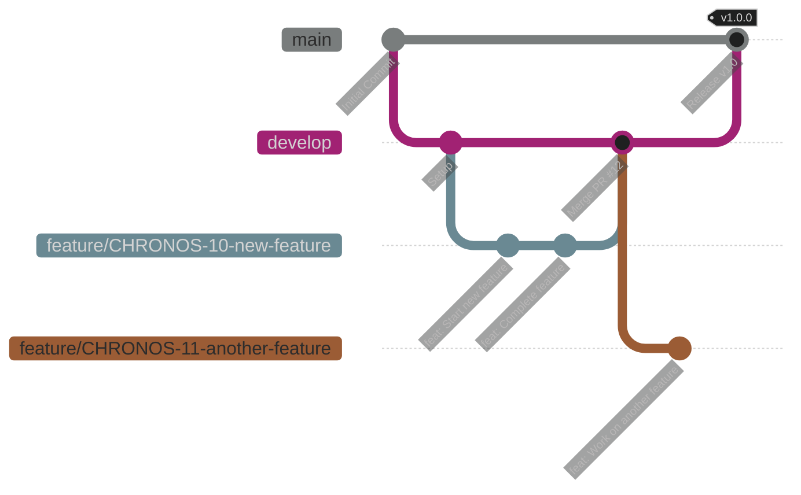

# ADR 004: Git Workflow and Branching Model

**Date:** 2025-11-15
**Status:** ✅ Accepted

## 1. Context

To maintain a clean, stable, and traceable codebase, we need a formal branching model and workflow for all development. This workflow must integrate seamlessly with our Jira project board to provide full traceability from idea to deployment.

## 2. Decision

We will adopt a simplified **Gitflow** branching model. All work will be done on **feature branches**, which will be merged into a `develop` branch via **Pull Requests (PRs)**. The `main` branch is reserved for stable, production-ready releases. All commit messages and PR titles will adhere to the **Conventional Commits** specification.

## 3. The Workflow

### Branching Model

*   **`main`**: This branch is the **SSOT for production**. It is always stable and deployable. Direct commits are forbidden.
*   **`develop`**: This is the **integration branch**. All completed feature branches are merged here. This branch represents the "next" version of the product.
*   **`feature/<jira-key>-<short-desc>`**: All new work (features, bug fixes, refactors) **must** be done on a feature branch.
    *   **Naming Convention:** `feature/CHRONOS-42-user-login-form`

### The Development Cycle

1.  **Create a Story in Jira:** A new piece of work is defined (e.g., `CHRONOS-42`).
2.  **Create a Feature Branch:** From the `develop` branch, create your new feature branch: `git checkout -b feature/CHRONOS-42-user-login-form`.
3.  **Do the Work:** Write your code and tests.
4.  **Commit with Conventional Commits:** Make small, atomic commits using the Conventional Commits format. **Crucially, include the Jira key in your commit messages** (e.g., `git commit -m "feat(auth): CHRONOS-42 Add login form"`).
5.  **Open a Pull Request:** When the feature is complete, push your branch to GitHub and open a PR to merge `feature/CHRONOS-42...` into `develop`.
6.  **PR Best Practices:**
    *   **Title:** The PR title **must** follow the Conventional Commit format and include the Jira key.
    *   **Link:** The PR description **must** include a link to the Jira story.
    *   **Checks:** The PR must pass all automated CI checks (linting, testing).
7.  **Merge:** Once the PR is approved (self-review is acceptable for now) and checks are green, merge it into `develop`.

---
