# 🗺️ PostGIS Fundamentals: A Project Chronos Cheat Sheet

**Version:** 1.0
**Status:** ✅ Core Concepts Established

This document is the Single Source of Truth for the core concepts, functions, and architectural patterns used for geospatial analysis in Project Chronos.

---

## 🏛️ Core Architectural Concepts

Our geospatial architecture is built on two key concepts: **Geometry vs. Geography** and the **Spatial Join**.

### 1. Geometry vs. Geography: The Two Worlds of PostGIS

PostGIS offers two fundamental types for storing spatial data. Choosing the right one is critical.

*   **`GEOMETRY`:**
    *   **What it is:** A "flat-earth" model. It treats all data as if it were on a 2D Cartesian plane.
    *   **Units:** The units are the same as the coordinate system (e.g., meters for a UTM projection). Calculations are simple and fast.
    *   **Best for:** Localized data (e.g., city maps) where the Earth's curvature is negligible.
    *   **Our Use:** We use this as our **storage and processing format** (`EPSG:4269` - NAD83), as it's the native format of our source TIGER data and is highly accurate for North America.

*   **`GEOGRAPHY`:**
    *   **What it is:** A "round-earth" model. It treats all data as points on a spheroid.
    *   **Units:** Always in **meters**, regardless of the coordinate system. Calculations are more complex but far more accurate for distance and area over large regions.
    *   **Best for:** Global or continental-scale analysis where accuracy matters.
    *   **Our Use:** We **cast** to `geography` during queries to get accurate, real-world measurements (e.g., "area in square kilometers").

**✨ Best Practice Workflow:** Store data in its native `geometry` projection for accuracy, but cast to `geography` for real-world measurements.

```sql
-- This query shows the difference in area calculation
SELECT
    name,
    ST_Area(geom) AS "Area in Sq. Degrees (Geometry)", -- ❌ Not very useful
    ST_Area(geom::geography) / 1000000 AS "Area in Sq. Kilometers (Geography)" -- ✅ Correct & useful
FROM boundaries.us_states
WHERE name = 'Texas';
```

### 2. The Spatial Join: The Heart of Geo-Economic Analysis

A spatial join is the core operation that allows us to combine our non-spatial economic data with our spatial boundary data. It doesn't use `ON a.id = b.id`; it uses a spatial function to link the two tables.

```mermaid
graph LR
    subgraph "Non-Spatial Economic Data"
        A["🏢 Housing Starts Table <br/> (series_id, date, value, location)"]
    end
    
    subgraph "Geospatial Data"
        B["🗺️ US Counties Table <br/> (geoid, name, geom)"]
    end

    subgraph "The Spatial Join"
        C{"JOIN ON ST_Contains(B.geom, A.location)"}
    end

    subgraph "Geo-Economic Insight"
        D[📈 Housing Starts per County]
    end

    A --> C
    B --> C
    C --> D
```



This simple pattern is the foundation for almost every valuable insight we will generate.

---

## 🔧 The 5 Essential PostGIS Functions

These five functions will be the workhorses for 90% of your geospatial queries.

### 1. `ST_Contains(geom_A, geom_B)`

*   **Question:** "Does Polygon A completely contain Geometry B?"
*   **Returns:** `boolean` (`true`/`false`).
*   **Primary Use Case:** The classic "point-in-polygon" test. This is how we will assign individual data points (like a housing start) to the county or state they fall within.
*   **Example:** Find the US State that contains the geographic coordinates of New York City.
    ```sql
    SELECT name
    FROM boundaries.us_states
    WHERE ST_Contains(geom, ST_SetSRID(ST_MakePoint(-74.0060, 40.7128), 4326));
    -- Result: 'New York'
    ```

### 2. `ST_Intersects(geom_A, geom_B)`

*   **Question:** "Do Geometry A and Geometry B touch or overlap in any way?"
*   **Returns:** `boolean` (`true`/`false`).
*   **Primary Use Case:** Finding all features that have a spatial relationship. It's more general than `ST_Contains`.
*   **Example:** Find all US States that intersect with the Mississippi River (represented as a `LINESTRING`).
    ```sql
    -- (Assuming a 'rivers' table exists)
    SELECT s.name
    FROM boundaries.us_states s
    JOIN boundaries.rivers r ON ST_Intersects(s.geom, r.geom)
    WHERE r.name = 'Mississippi';
    ```

### 3. `ST_Area(geography)`

*   **Question:** "What is the surface area of this polygon?"
*   **Returns:** `double precision` (in square meters).
*   **Primary Use Case:** Normalizing data to create density metrics, like "population per square kilometer." This is critical for making fair comparisons between large and small regions.
*   **Example:** List the 5 largest US states by land area.
    ```sql
    SELECT
        name,
        (ST_Area(geom::geography) / 1000000) AS area_sq_km
    FROM boundaries.us_states
    ORDER BY area_sq_km DESC
    LIMIT 5;
    ```

### 4. `ST_Centroid(geom)`

*   **Question:** "What is the geometric center of this shape?"
*   **Returns:** A `POINT` `geometry`.
*   **Primary Use Case:** Creating a single point to represent a large area, perfect for placing a pin on a map in a BI tool like Metabase or for calculating distances between regions.
*   **Example:** Get the coordinates of the centroid of Texas.
    ```sql
    SELECT ST_AsText(ST_Centroid(geom))
    FROM boundaries.us_states
    WHERE name = 'Texas';
    -- Result: 'POINT(-99.68361 31.16955)'
    ```

### 5. `ST_Distance(geography_A, geography_B)`

*   **Question:** "What is the shortest distance between these two objects?"
*   **Returns:** `double precision` (in meters).
*   **Primary Use Case:** Proximity analysis. "Find all census tracts within a 10km radius of a proposed new factory."
*   **Example:** Calculate the distance between the centroids of Texas and California.
    ```sql
    WITH texas AS (
        SELECT ST_Centroid(geom)::geography AS center FROM boundaries.us_states WHERE name = 'Texas'
    ),
    california AS (
        SELECT ST_Centroid(geom)::geography AS center FROM boundaries.us_states WHERE name = 'California'
    )
    SELECT ST_Distance(texas.center, california.center) / 1000 AS distance_km
    FROM texas, california;
    -- Result: ~1800 km
    ```

---

## 💡 Live Documentation with SQL & Markdown

You asked about incorporating "evidence" directly into your documentation. This is a fantastic idea that leads to "living documentation." While a direct, live link isn't feasible in a standard Markdown file, we can adopt a workflow that makes it easy to keep docs in sync with reality.

**The "Verifiable Documentation" Workflow:**

1.  **Write Queries in VS Code:** Use the VS Code SQLTools extension to write and run your queries directly against your dev database.
2.  **Use "Save Results as CSV/Markdown":** SQLTools allows you to export the result of a query. For documentation, you can export it as a Markdown table.
3.  **Paste as Evidence:** Paste the query and the resulting Markdown table directly into your documentation file.

**Example in `gis_workflow.md`:**

> ### Verification Step 4: Inspect an Attribute
>
> We run the following query to ensure the attribute data for Texas was loaded correctly.
>
> ```sql
> SELECT name, statefp FROM boundaries.us_states WHERE name = 'Texas';
> ```
>
> **Last Verified Output (2025-11-13):**
>
> | name  | statefp |
> | :---- | :------ |
> | Texas | 48      |
>
> This confirms the data is correct.

By including the query and its verified output, your documentation becomes a "lab notebook" that is both instructional and evidential. It dramatically increases the context and trust for yourself and any future collaborators.
