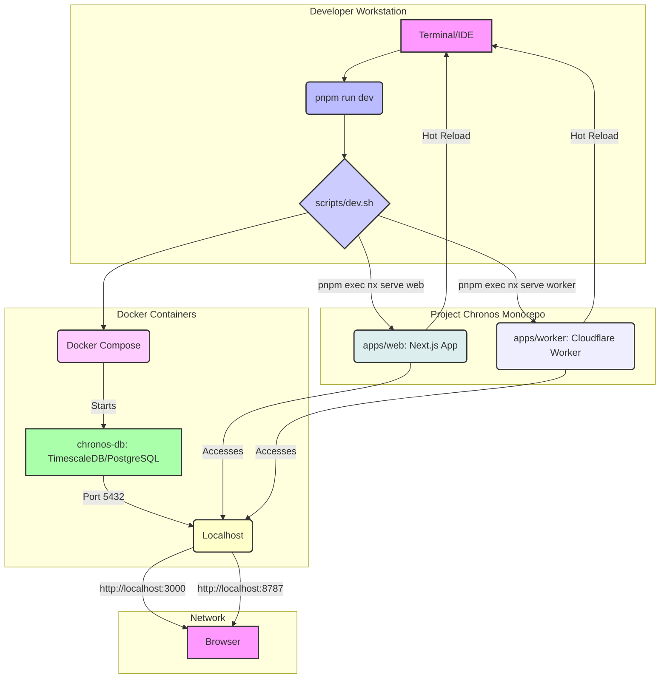

# Local Development Architecture

This diagram illustrates the key components and their interactions within the local development environment for Project Chronos.

```mermaid
graph TD
    subgraph Developer Workstation
        A[Terminal/IDE] --> B(pnpm run dev)
        B --> C{scripts/dev.sh}
    end

    subgraph Docker Containers
        C --> D(Docker Compose)
        D -- "Starts" --> E[chronos-db: TimescaleDB/PostgreSQL]
        E -- "Port 5432" --> F(Localhost)
    end

    subgraph Project Chronos Monorepo
        C -- "pnpm exec nx serve web" --> G(apps/web: Next.js App)
        C -- "pnpm exec nx serve worker" --> H(apps/worker: Cloudflare Worker)
        G -- "Accesses" --> F
        H -- "Accesses" --> F
        G -- "Hot Reload" --> A
        H -- "Hot Reload" --> A
    end

    subgraph Network
        F -- "http://localhost:3000" --> I[Browser]
        F -- "http://localhost:8787" --> I
    end

    style A fill:#f9f,stroke:#333,stroke-width:2px
    style B fill:#bbf,stroke:#333,stroke-width:2px
    style C fill:#ccf,stroke:#333,stroke-width:2px
    style D fill:#fcf,stroke:#333,stroke-width:2px
    style E fill:#afa,stroke:#333,stroke-width:2px
    style F fill:#ffc,stroke:#333,stroke-width:2px
    style G fill:#dee,stroke:#333,stroke-width:2px
    style H fill:#eef,stroke:#333,stroke-width:2px
    style I fill:#f9f,stroke:#333,stroke-width:2px
```
