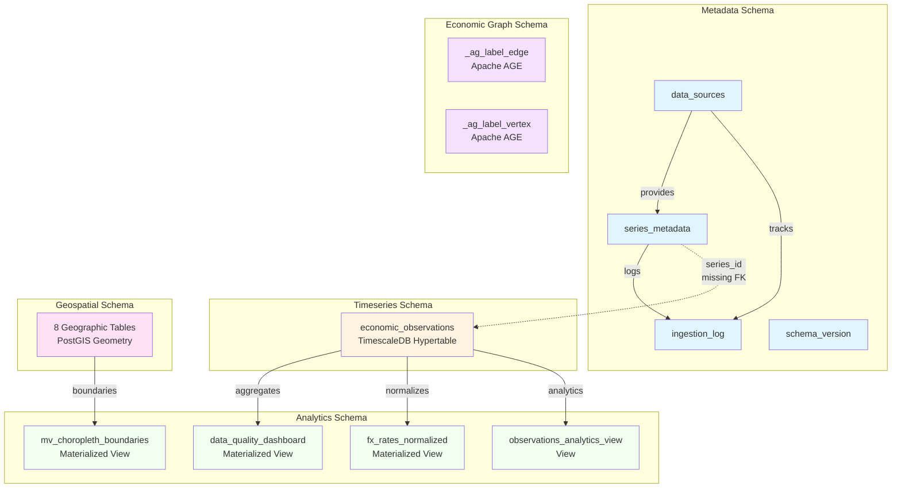
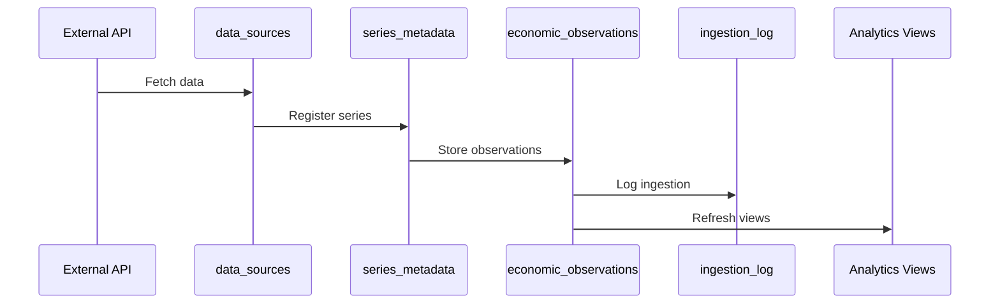

# Complete Schema Overview

## Schema Purposes

| Schema | Color | Purpose | Tables/Views |
|--------|-------|---------|--------------|
| **Metadata** | 🔵 Blue | Series definitions, data sources, ingestion tracking | 4 tables |
| **Timeseries** | 🟡 Yellow | Time-series observations (hypertable) | 1 table |
| **Analytics** | 🟢 Green | Analytical views and dashboards | 4 views |
| **Geospatial** | 🔴 Pink | Geographic boundaries (PostGIS) | 8 tables |
| **Economic Graph** | 🟣 Purple | Graph database (Apache AGE) | 2 tables |

---

## Data Flow

---

## Key Relationships

### Enforced (Foreign Keys)
1. `series_metadata.source_id` → `data_sources.source_id`
2. `ingestion_log.source_id` → `data_sources.source_id`
3. `ingestion_log.series_id` → `series_metadata.series_id`

### Logical (Not Enforced)
1. ⚠️ `economic_observations.series_id` → `series_metadata.series_id` (MISSING FK)

### View Dependencies
1. `data_quality_dashboard` depends on `economic_observations`
2. `fx_rates_normalized` depends on `economic_observations`
3. `observations_analytics_view` depends on `economic_observations`
4. `mv_choropleth_boundaries` depends on `geospatial` tables

---

## Schema Isolation

Each schema serves a distinct purpose with minimal cross-schema dependencies:

- **Metadata**: Self-contained, defines all series and sources
- **Timeseries**: Depends on metadata for series definitions
- **Analytics**: Depends on timeseries for data
- **Geospatial**: Independent, provides geographic context
- **Economic Graph**: Independent, graph relationships

This separation allows for:
- Independent scaling
- Clear ownership boundaries
- Easier testing and maintenance
- Potential future microservices architecture
