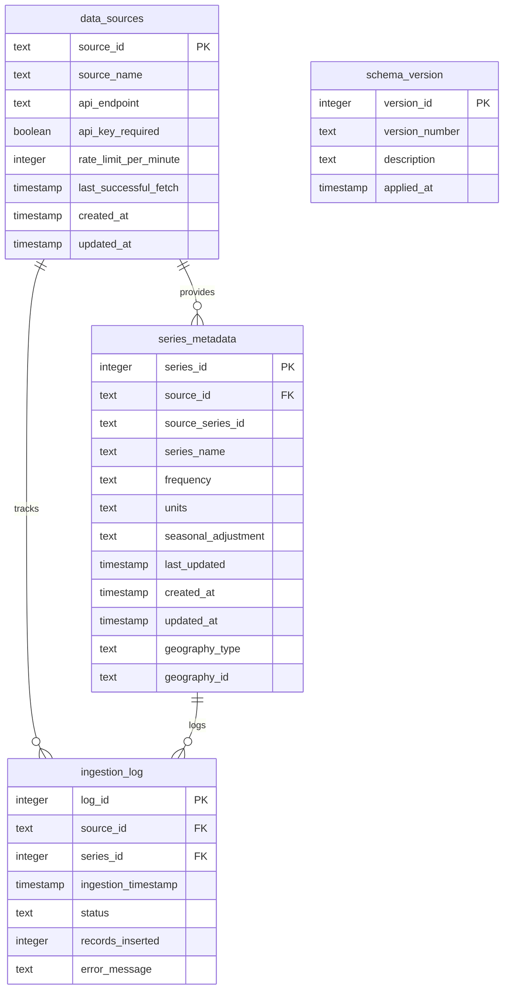

# Metadata Schema - Entity Relationship Diagram

## Relationships

### data_sources → series_metadata
- **Type**: One-to-Many
- **FK**: `series_metadata.source_id` → `data_sources.source_id`
- **Description**: Each data source can provide multiple time series

### data_sources → ingestion_log
- **Type**: One-to-Many
- **FK**: `ingestion_log.source_id` → `data_sources.source_id`
- **Description**: Each data source has multiple ingestion log entries

### series_metadata → ingestion_log
- **Type**: One-to-Many
- **FK**: `ingestion_log.series_id` → `series_metadata.series_id`
- **Description**: Each series has multiple ingestion log entries

---

## Key Observations

1. **Well-Defined Relationships**: All foreign keys properly defined with referential integrity
2. **Audit Trail**: `ingestion_log` provides comprehensive tracking of data ingestion
3. **Versioning**: `schema_version` tracks database migrations
4. **Unique Constraints**: Composite unique index on `(source_id, source_series_id)` prevents duplicates
