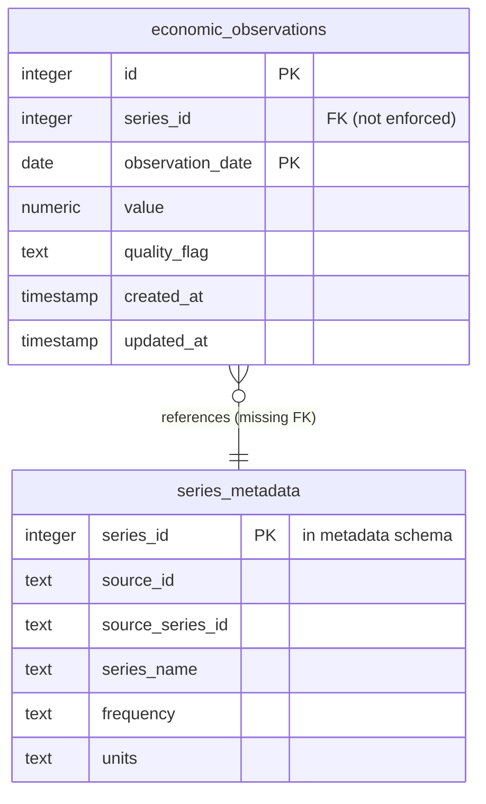

# Timeseries Schema - Entity Relationship Diagram



## Schema Details

### economic_observations (TimescaleDB Hypertable)

**Purpose**: Store time-series economic data with high performance for time-based queries

**Key Features**:
- **Hypertable**: Automatically partitioned by `observation_date` for optimal time-series performance
- **Composite Primary Key**: `(id, observation_date)` required for hypertable
- **Unique Constraint**: `(series_id, observation_date)` prevents duplicate observations
- **Partial Index**: Index on `value` WHERE `value IS NOT NULL` for efficient non-null queries

### Indexes

| Index Name | Type | Columns | Purpose |
|------------|------|---------|---------|
| `economic_observations_pkey` | UNIQUE | `id, observation_date` | Primary key (hypertable requirement) |
| `idx_series_date_unique` | UNIQUE | `series_id, observation_date` | Prevent duplicate observations |
| `economic_observations_observation_date_idx` | BTREE | `observation_date DESC` | Time-based queries |
| `idx_obs_date` | BTREE | `observation_date DESC` | **DUPLICATE** - can be removed |
| `idx_obs_value` | BTREE | `value` (partial) | Non-null value queries |

---

## ⚠️ Missing Foreign Key Constraint

**Issue**: No enforced foreign key relationship between `economic_observations.series_id` and `metadata.series_metadata.series_id`

**Impact**:
- Potential for orphaned observations
- No automatic cascade on series deletion
- Referential integrity not enforced at database level

**Recommendation**:
```sql
ALTER TABLE timeseries.economic_observations
ADD CONSTRAINT fk_observations_series
FOREIGN KEY (series_id) 
REFERENCES metadata.series_metadata(series_id)
ON DELETE CASCADE;
```

**Considerations**:
- May need to check for existing orphaned records first
- Could impact ingestion performance (FK check overhead)
- Provides data integrity guarantee

---

## Cross-Schema Relationship


The timeseries schema depends on the metadata schema for series definitions, but this relationship is currently not enforced at the database level.
