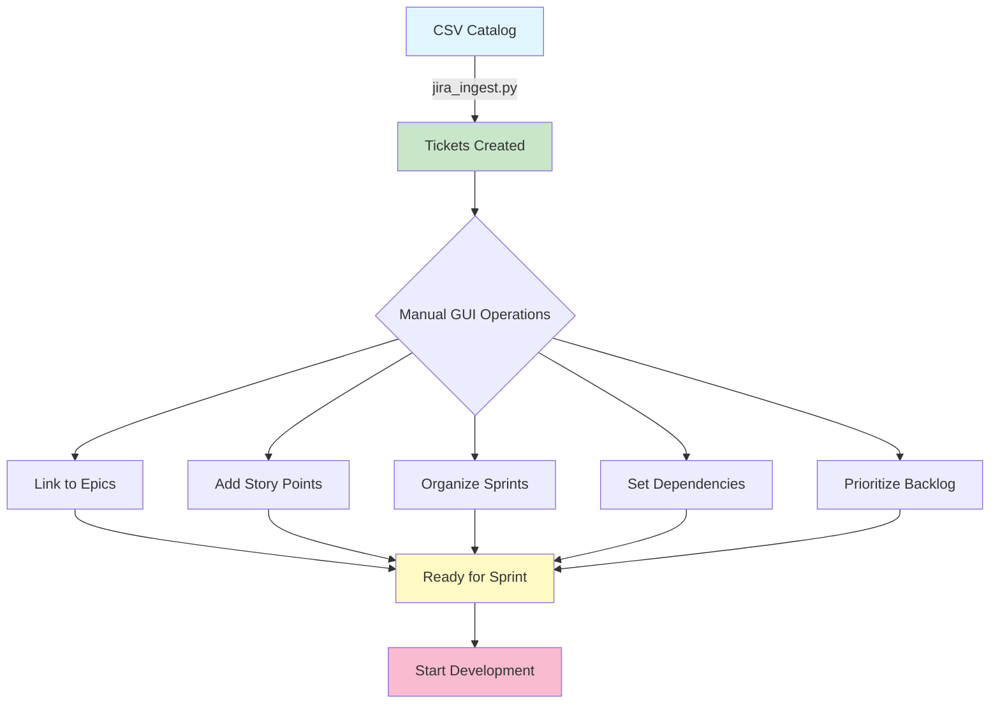

# 🎯 Manual Jira Operations Guide

## Overview

After automated ticket creation via `jira_ingest.py`, some operations are **faster and easier in the GUI** than via API. This guide shows the optimal workflow for post-creation configuration.

---

## 📊 Workflow: Automation → Manual Configuration



---

## 🔗 Operation 1: Link Tickets to Epics (5 min)

### **Why Manual?**

Next-gen Jira doesn't support Epic Links via API, but GUI makes it instant.

### **Process:**

1. **Open Board View**

   - Navigate to: https://automatonicai.atlassian.net/jira/software/projects/CHRONOS/boards/1

2. **Enable Epic Panel**

   - Click "⋯" (Board settings)
   - Enable "Epics panel"

3. **Drag & Drop**

   ```
   Epic: CHRONOS-124 (Business Ops)
   ├─ Drag → CHRONOS-125 (DNS Investigation)
   ├─ Drag → CHRONOS-126 (Email Migration)
   ├─ Drag → CHRONOS-127 (CRM Setup)
   └─ Drag → CHRONOS-128 (Marketing)
   ```

4. **Verify**
   - Open any child ticket
   - Should show "Epic Link: CHRONOS-124"

**⏱️ Time: ~30 seconds per epic**

---

## 📈 Operation 2: Add Story Points (3 min)

### **Why Manual?**

Next-gen Jira uses simplified estimation. GUI is faster than API custom fields.

### **Process:**

1. **Open Backlog**

   - https://automatonicai.atlassian.net/jira/software/projects/CHRONOS/boards/1/backlog

2. **Estimate Tickets**

   - Click ticket card
   - Click "Estimate" field (top right)
   - Enter points: 1, 2, 3, 5, 8, 13

3. **Bulk Estimate (Faster)**
   - Select multiple tickets (Cmd/Ctrl + Click)
   - Right-click → "Estimate"
   - Enter points for all

**⏱️ Time: ~10 seconds per ticket**

### **Recommended Point Scale:**

```
1 point  = < 2 hours  (Quick fix, small change)
2 points = 2-4 hours  (Small feature, straightforward)
3 points = 4-8 hours  (Medium feature, some complexity)
5 points = 1-2 days   (Large feature, moderate complexity)
8 points = 2-3 days   (Complex feature, research needed)
13 points = 1 week    (Very complex, break into smaller tickets)
```

---

## 🏃 Operation 3: Organize Sprints (10 min)

### **Process:**

1. **Create Sprint**

   - Backlog view → "Create Sprint"
   - Name: "Sprint 3: Data Automation"
   - Goal: "Complete Valet ingestion + Jira automation"

2. **Add Tickets to Sprint**

   - Drag tickets from backlog → Sprint
   - Recommended for Sprint 3:

     ```
     High Priority:
     - CHRONOS-117 (Clean invalid FRED series)
     - CHRONOS-130 (Valet ingestion - TO BE CREATED)
     - CHRONOS-131 (Confluence automation - TO BE CREATED)

     Medium Priority:
     - CHRONOS-115 (Lock dependencies)
     - CHRONOS-116 (Fix logging schema)

     Low Priority:
     - CHRONOS-119 (GitHub CLI)
     ```

3. **Start Sprint**
   - Click "Start Sprint"
   - Duration: 1-2 weeks
   - Start date: Today

**⏱️ Time: ~5 minutes**

---

## 🔀 Operation 4: Set Dependencies (Optional, 5 min)

### **When to Use:**

When one ticket blocks another (e.g., "Can't test Valet until FRED is fixed")

### **Process:**

1. **Open Blocked Ticket**

   - Click ticket in board

2. **Add Link**

   - Click "⋯" → "Link Issue"
   - Type: "is blocked by"
   - Issue: CHRONOS-XXX
   - Save

3. **Visual Indicator**
   - Blocked tickets show 🔒 icon
   - Hover to see blocker

**⏱️ Time: ~30 seconds per link**

---

## 📋 Operation 5: Prioritize Backlog (5 min)

### **Process:**

1. **Open Backlog View**

2. **Drag to Reorder**

   - Top = Highest priority
   - Bottom = Lowest priority

3. **Recommended Order:**

   ```
   P0 (Critical):
   1. CHRONOS-117 (Clean FRED data)
   2. CHRONOS-130 (Valet automation)

   P1 (High):
   3. CHRONOS-115 (Lock dependencies)
   4. CHRONOS-116 (Fix logging)
   5. CHRONOS-131 (Confluence automation)

   P2 (Medium):
   6. CHRONOS-114 (Sprint docs)
   7. CHRONOS-119 (GitHub CLI)

   P3 (Low):
   8. Business ops tickets (CHRONOS-124-129)
   ```

**⏱️ Time: ~2 minutes**

---

## ✅ Complete Workflow Checklist

```
Sprint Setup (15 min):
□ Link epics (5 min)
□ Add story points (3 min)
□ Create sprint (2 min)
□ Add tickets to sprint (3 min)
□ Prioritize backlog (2 min)

Optional (5 min):
□ Set dependencies
□ Add custom labels
□ Update descriptions
□ Assign tickets
```

---

## 🚀 Quick Reference

| Operation       | Time     | Tool | Why Manual?            |
| --------------- | -------- | ---- | ---------------------- |
| Create Tickets  | Auto     | API  | ✅ Automated           |
| Link Epics      | 30s each | GUI  | API not supported      |
| Story Points    | 10s each | GUI  | Simplified in next-gen |
| Sprint Planning | 5 min    | GUI  | Visual workflow better |
| Dependencies    | 30s each | GUI  | Rare operation         |
| Prioritize      | 2 min    | GUI  | Drag-drop fastest      |

---

## 💡 Pro Tips

1. **Bulk Operations**

   - Select multiple (Cmd/Ctrl + Click)
   - Apply changes to all at once

2. **Keyboard Shortcuts**

   - `c` = Create issue
   - `e` = Edit issue
   - `/` = Search
   - `g + b` = Go to board

3. **Board Filters**

   - Create saved filters for:
     - "My tickets"
     - "High priority"
     - "Blocked"

4. **Sprint Goals**
   - Always set clear sprint goal
   - Review in daily standups (even solo)

---

## 📊 Post-Sprint: Confluence Documentation

After sprint completion, use `confluence_ingest.py` to automatically generate:

- Sprint retrospective
- Completed tickets summary
- Lessons learned
- Next sprint planning

_See: `docs/confluence_automation.md` (TO BE CREATED)_

---

## 🔗 Related Documentation

- [Jira Automation Guide](./jira_automation.md)
- [CSV Catalog Schema](./catalog_schemas.md)
- [Sprint Planning Template](./sprint_planning.md)

---

**Last Updated:** 2024-11-19
**Maintained By:** Project Chronos Team
