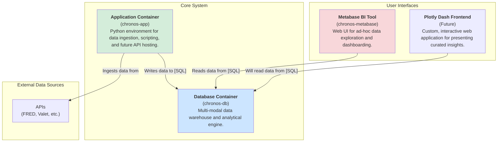
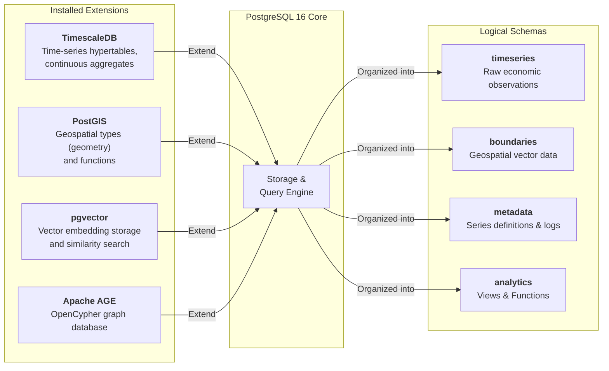
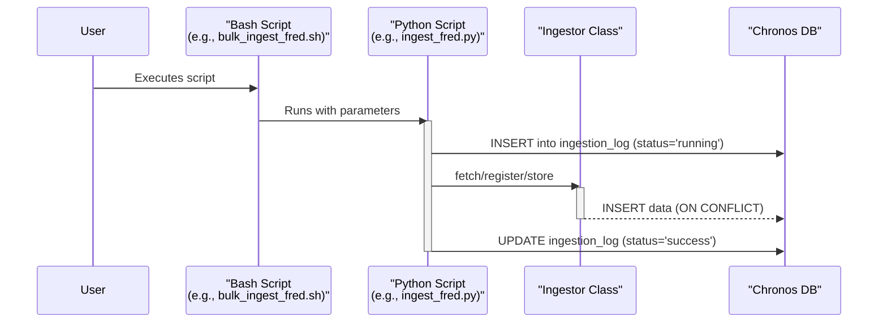

# 🏛️ Project Chronos: System Architecture

**Version:** 2.1
**Last Updated:** 2025-11-14
**Status:** ✅ Implemented & Stable

This document provides a comprehensive overview of the architecture for Project Chronos, a multi-modal macroeconomic and financial data platform. It details the guiding principles, components, data flows, and design decisions that define the system.

## 1. C4 Model: A Layered View

We use the [C4 Model](https://c4model.com/) to describe the architecture at different levels of abstraction.

### Level 1: System Context

This diagram shows how Project Chronos fits into its ecosystem, interacting with users, tools, and external data providers.

```mermaid
graph TD
    subgraph "Users & Tools"
        direction LR
        A[👩‍💻 Financial Analyst]
        B[📊 Metabase]
        C[🐘 pgAdmin4]
    end

    subgraph "Project Chronos"
        P[<b style='font-size:1.2em'>Project Chronos</b><br/>Multi-modal economic data platform.]
    end

    subgraph "External Data Sources"
        direction LR
        D[🏦 FRED API]
        E[🏦 Valet API]
        F[🗺️ US Census TIGER/Line]
        G[🗺️ Statistics Canada]
    end

    A -- "Uses" --> P
    A -- "Analyzes via" --> B
    A -- "Administers via" --> C

    B -- "Queries [SQL]" --> P
    C -- "Manages [SQL]" --> P

    P -- "Ingests Time-Series Data" --> D & E
    P -- "Ingests Geospatial Data" --> F & G
```

### Level 2: Container Diagram

This diagram zooms into Project Chronos, showing the major deployable components (containers) and their responsibilities.

### Level 3: Component Diagram (Database)

This diagram zooms into the **Database Container**, showing how PostgreSQL is extended to create our multi-modal capabilities.

## 2. Data Flow & Logic

### Ingestion Flow

The data ingestion process is automated via a suite of version-controlled scripts, designed to be robust and auditable.

### Analytical Logic Layers 

Our architecture pushes complex logic down into the database, ensuring consistency and performance for all data consumers.

```mermaid
graph BT
    subgraph "Data Consumers"
        A[📊 Metabase]
        B[🐍 Python Reports]
        C[⚡ Future API]
    end
    
    subgraph "Analytical Layers (in PostgreSQL)"
        L4["<b>Layer 4:</b><br/>Functions<br/>(e.g., calculate_yoy_growth)"]
        L3["<b>Layer 3:</b><br/>Aggregates<br/>(e.g., fx_daily_summary)"]
        L2["<b>Layer 2:</b><br/>Insight Views<br/>(e.g., v_admin_1_boundaries)"]
        L1["<b>Layer 1:</b><br/>Normalization Views<br/>(e.g., fx_rates_normalized)"]
    end

    subgraph "Raw Data Schemas"
        D[timeseries]
        E[boundaries]
    end

    A & B & C -- "Query" --> L4 & L3 & L2
    L4 & L3 & L2 -- "Build upon" --> L1
    L1 -- "Abstracts" --> D & E
```

