# 🏛️ Project Chronos: A Consolidated Architectural Deep Dive

**Version:** 1.0
**Status:** ✅ Live
**Purpose:** This document is the **Single Source of Truth (SSOT)** for the "as-is" architecture of Project Chronos. It provides a comprehensive, layered analysis of the platform, including a critical assessment of its strengths, weaknesses, and strategic opportunities for improvement.

---

## 🗺️ Master Architecture Diagram

This diagram provides a holistic view of how the platform's layers interact to transform raw data from external sources into actionable intelligence for the end-user.

```mermaid
graph TD
    subgraph "External Ecosystem"
        direction LR
        U[👩‍💻 Investment Professional]
        DS1[🏦 FRED API]
        DS2[🇨🇦 Valet API]
        DS3[🗺️ Census/StatCan]
    end

    subgraph "Project Chronos Platform"
        direction TB
        L2["<b>L2: Orchestration Layer</b><br/>(Makefile, Docker, GitHub Actions)"]
        L3["<b>L3: Application Layer</b><br/>(Python, SQLAlchemy, Structlog)"]
        L4["<b>L4: Data Layer</b><br/>(PostgreSQL, TimescaleDB, PostGIS, AGE)"]
        L5["<b>L5: Verification Layer</b><br/>(Pytest)"]
        
        L2 -- "Builds & Runs" --> L3 & L4
        L3 -- "Reads/Writes" --> L4
        L5 -- "Validates" --> L3 & L4
    end

    U -- "Receives Insights" --> L4
    L3 -- "Ingests Data From" --> DS1 & DS2 & DS3

    style L2 fill:#fce8e6
    style L3 fill:#e8f0fe
    style L4 fill:#e6f4ea
    style L5 fill:#fffde7
```

---

## 🔬 Layer-by-Layer Analysis

### **Layer 1: 🎯 The Strategic Layer (The "Why")**
This layer defines the business purpose and governs the direction of the project. It translates market needs into actionable data strategy.

| Component | Purpose | Key Artifact(s) |
| :--- | :--- | :--- |
| **Business Vision** | To create a "Relationship Intelligence Engine" that maps opaque private markets to generate proprietary deal flow. | `docs/0_project_vision_and_strategy/outreach/` |
| **Prioritization Framework** | The RICE framework provides a data-driven method for selecting the most valuable analytical verticals to pursue. | [RICE Analysis CSV](../2_architecture/adrs/rice_analysis.csv) |
| **Data Governance** | The "Hub & Spoke" model ensures all data assets are consistently defined, cataloged, and understood. | `database/seeds/asset_catalog.csv` (The "Spoke") `database/seeds/ontology_hub.csv` (The "Hub") |

#### **Critical Assessment:**
*   **💎 Strength:** The strategic pivot from a generic macro tool to a specific "Deal Engine" is a massive competitive advantage. It provides a clear, high-value North Star for all future development.
*   **💎 Strength:** The formal RICE and Governance models are professional-grade. They prevent ad-hoc development and ensure the platform scales logically, not chaotically.
*   **🧱 Weakness:** The current `asset_catalog.csv` is a powerful manifest, but the process of acting on it is entirely manual. The link between "planning" an asset in the CSV and actually ingesting it is just manual developer action.
*   **🚀 Opportunity:** **Automate the Asset Catalog.** The platform should be able to read the catalog and automatically trigger the correct ingestion scripts for any asset marked as `Planned`. This would be the first major step toward a self-orchestrating system.

---

### **Layer 2: 🚀 The Orchestration Layer (The "How It Runs")**
This layer defines the platform's runtime environment. It is responsible for building, configuring, and running all the services that constitute the application.

| Component | Purpose | Key Artifact(s) |
| :--- | :--- | :--- |
| **Service Definition** | Docker Compose defines the multi-container application stack and manages networking between services. | `docker-compose.yml` `docker-compose.override.yml` |
| **Container Builds** | Dockerfiles provide the blueprints for building the custom Python application and multi-modal database containers. | `Dockerfile` `Dockerfile.timescaledb` |
| **Developer Experience** | A `Makefile` provides a simple, high-level command interface for common tasks. | `Makefile` |
| **Continuous Integration** | GitHub Actions automates linting, testing, and coverage reporting. | `.github/workflows/ci.yml` |
| **Quality Gates** | Pre-commit hooks automatically run checks before every commit. | `.pre-commit-config.yaml` |

#### **Critical Assessment:**
*   **💎 Strength:** The use of Dev Containers and Docker Compose provides a perfectly reproducible development environment. This is a best-in-class setup that eliminates "works on my machine" issues.
*   **💎 Strength:** The CI/CD pipeline is robust, correctly using healthchecks to prevent race conditions and even reporting on test coverage.
*   **🧱 Weakness:** The root directory is cluttered with configuration files (`pyproject.toml`, `Makefile`, etc.), which increases cognitive overhead for a developer new to the project.
*   **🚀 Opportunity:** **Consolidate Configuration.** As planned, moving all root-level config files into a dedicated `/config` directory would significantly clean up the project structure and improve the developer experience.

---

### **Layer 3: 🐍 The Application Layer (The "Engine Room")**
This is the core Python logic that executes the business vision. It is responsible for configuration, database interaction, and all data processing.

| Component | Purpose | Key Artifact(s) |
| :--- | :--- | :--- |
| **Configuration** | Pydantic `Settings` provides type-safe, environment-aware configuration. | `src/chronos/config/settings.py` |
| **DB Connectivity** | A robust SQLAlchemy module manages a connection pool and ensures safe, transactional sessions. | `src/chronos/database/connection.py` |
| **Ingestion Framework** | The `BaseIngestor` Abstract Base Class defines a strict, extensible contract for all data source integrations. | `src/chronos/ingestion/base.py` |
| **Ingestion Logic** | Concrete `FREDIngestor` and `ValetIngestor` classes implement the logic to fetch and parse data. | `src/chronos/ingestion/fred.py` `src/chronos/ingestion/valet.py` |
| **Automation Scripts** | `click`-based CLI scripts and Bash wrappers provide the operational entry points. | `src/scripts/*` `scripts/*` |

#### **Critical Assessment:**
*   **💎 Strength:** The code quality is exceptionally high. The use of Pydantic for settings, a context manager for DB sessions, and an ABC for the ingestion framework are all hallmarks of a senior engineer building for the long term.
*   **🧱 Weakness:** The bash orchestration scripts (`bulk_ingest.sh`, `bulk_ingest_fred.sh`) are a major piece of technical debt. The former is dangerously inefficient (one process per series), and both contain hardcoded lists of series, making them brittle and difficult to maintain.
*   **🚀 Opportunity:** **Unify and Elevate Ingestion.** Deprecate the inefficient bash scripts in favor of a single, powerful Python script (`master_ingest.py`). This script would be data-driven, reading its instructions directly from the `asset_catalog.csv`, making the entire ingestion process more robust, efficient, and scalable.

---

### **Layer 4: 🐘 The Data Layer (The "Heart")**
This layer is the system's core asset. It is where all data is stored, structured, and transformed into high-value insights.

| Component | Purpose | Key Artifact(s) |
| :--- | :--- | :--- |
| **Multi-Modal Core** | PostgreSQL is extended with TimescaleDB, PostGIS, pgvector, and Apache AGE. | `Dockerfile.timescaledb` |
| **Schema Definition** | The master `schema.sql` file acts as the SSOT for all tables, indexes, and relationships. | `database/schema.sql` |
| **Analytical Logic** | A suite of version-controlled SQL `Views` pushes complex business logic into the database. | `database/views.sql` `database/analytics_views/*` |

#### **Critical Assessment:**
*   **💎 Strength:** The multi-modal database design is the project's "superpower." Manually compiling all extensions into a single, cohesive container gives the platform a unique and powerful competitive advantage.
*   **💎 Strength:** Pushing analytical logic into SQL views is a highly scalable pattern that ensures all data consumers (dashboards, APIs, notebooks) receive consistent, performant results.
*   **🧱 Weakness:** The schema is managed via a single, monolithic `.sql` file. As the platform grows, making changes to this file becomes risky and error-prone. There is no mechanism for versioning or safely applying incremental changes to a live database.
*   **🚀 Opportunity:** **Implement a Migration Framework.** Adopting a tool like Alembic (the Python/SQLAlchemy standard) would solve this problem completely. It would allow for schema changes to be managed as small, version-controlled, reversible migration scripts, which is the industry standard for production database management.

---

### **Layer 5: ✅ The Verification Layer (The "Proof")**
This layer provides the guarantee that all other layers are functioning correctly. It is the project's safety net and quality enforcer.

| Component | Purpose | Key Artifact(s) |
| :--- | :--- | :--- |
| **Unit Tests** | Test pure, isolated Python logic (e.g., financial calculations). | `tests/unit/test_calculations.py` |
| **Integration Tests** | Verify the interactions between components (e.g., app-to-db). | `tests/integration/test_database.py` |
| **End-to-End Tests** | Validate the entire business workflow, from API call to analytics view. | `tests/e2e/test_ingestion_workflow.py` |
| **Fixtures** | `conftest.py` provides shared, reusable setup logic for the entire test suite. | `tests/conftest.py` |

#### **Critical Assessment:**
*   **💎 Strength:** The test suite is architecturally sound, with a clear and correct separation between unit, integration, and end-to-end tests. This structure makes testing robust and maintainable.
*   **🧱 Weakness:** The current test coverage (26%) is low, meaning large parts of the application logic are not automatically verified. This increases the risk of regressions.
*   **🧱 Weakness:** The integration and E2E tests rely on a manually-seeded database. This makes them brittle and non-hermetic; a test run could be influenced by the state left over from a previous run or a manual change.
*   **🚀 Opportunity:** **Implement Data Fixtures.** Create a set of Pytest fixtures that load a small, well-defined, and consistent set of test data into a clean database before each test run. This will make the tests faster, more reliable, and will make it significantly easier to write new tests, which will naturally drive up coverage.
